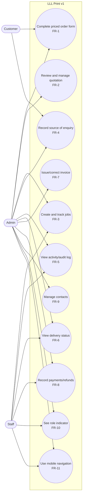

# Software Requirements Specification (SRS)

Project: LLL Print
Status: Draft — the current phase includes completing and reviewing the SRS
development baseline; it remains Draft until accepted.
Last updated: 2026-09-24

This document specifies what LLL Print must do: product context, v1
scope, and the functional/non-functional requirements derived from that
scope. It does not authorize implementation on its own — see
`docs/SPMP.md` for what's actually authorized at the current phase.

## 1. Product context

### Purpose

This document defines what LLL Print must do before its UI/UX, architecture,
database and interfaces are finalised in `docs/SDD.md`. It describes the
intended system rather than treating the existing prototype as the source of
requirements.

### Scope

LLL Print is a responsive web product for Malaysian print-shop operations.
Its main purpose is to capture agreed order information once and reuse it
through quotation, invoicing, production and fulfilment.

Design discussion and agreement happen outside LLL Print. After agreement,
Admin selects or creates the customer and may generate a private order-form
link tied to that company and customer. The customer opens the link without
creating an account, or Admin completes the same form internally. The mockup
is optional at submission and may be attached later by authorised Staff; it is
required before production release. The system generates the quotation from
the submitted information.
Admin confirms the order, creates the production handoff and issues the
invoice. Confirmed payment gates control when production and shipping may
proceed.

`docs/SPMP.md` defines the project scope and milestones. `docs/SDD.md` will
define how the UI/UX, architecture, database, attachments and interfaces meet
these requirements.

### Normal order journey

```mermaid
flowchart LR
    D[Design agreed outside LLL Print] --> F[Customer or Admin completes priced form]
    F --> Q[Generate submitted quotation]
    Q --> A[Admin reviews order and sets deposit]
    A --> J[Confirm order: create job and issue invoice together]
    J --> P[Meet Admin-set deposit requirement, including RM0]
    P --> M[Ensure agreed mockup is attached]
    M --> H[Admin releases job to factory]
    H --> R[Factory Staff produce and complete order]
    R --> B[Confirm remaining balance]
    B --> S[Ship or hand over order]
```

Form submission replaces the old separate sent-and-accepted steps for this
normal journey. The customer has already agreed to the design and sees the
calculated price before submission. For an Admin-entered order, Admin records
that the customer confirmed the displayed details before proceeding.

Submission does not automatically issue an invoice or start production.
Admin confirms the submitted order first. Admin sets the deposit requirement
per order from RM0 up to the invoice total. A zero requirement needs no receipt;
a positive requirement must be met by confirmed payments. Meeting it makes the
job eligible for Admin release to factory Staff but does not automatically start
production. Factory Staff use LLL Print to update progress and record
completion. Corrections, cancellation and resubmission follow FR-2.

Admin maintains standard prices and may assign customer-specific prices. A
one-time order price may be set by Admin when a particular agreement requires
it. The applicable price is resolved for the selected clothing type, material
type, GSM and other approved price inputs, in this order: one-time order price,
customer-specific price, then standard price. Customers can view the resolved
price but cannot edit it. Submission preserves the exact displayed price in
the quotation so later price-list changes do not alter historical documents.

Admin configures a controlled product catalogue rather than relying on
hardcoded choices or an unrestricted form builder. The catalogue defines the
available clothing types, materials, GSM values, colours, sizes, printing
methods, print locations and other approved options. Admin controls which
choices are active or required and their standard prices or adjustments. The
customer form presents these configured choices. A submitted quotation
preserves the selected option labels and price effects so later catalogue
changes do not alter earlier orders.

| Term | Meaning in LLL Print |
|---|---|
| Customer | The person or organisation ordering printed goods |
| Contact | Reusable customer or supplier information |
| Priced order form | The shared form used by a customer or Admin after design agreement |
| Product catalogue | Admin-configured products, option groups, choices and price effects used by the form |
| Standard price | The default Admin-maintained price used when no more specific price applies |
| Customer-specific price | An Admin-maintained price that applies to one customer |
| One-time order price | An Admin-set exception that applies only to one order |
| Mockup | The picture attached as the visual reference for the agreed order |
| Quotation | The generated record of submitted selections, quantities and calculated price |
| Job | The preserved production handoff created after Admin confirmation |
| Invoice | The Admin-issued record of the amount the customer owes |
| Payment | One confirmed receipt of money against the invoice |
| Shipping | The company sending a production-complete order to the customer after normal settlement or an Admin-approved unpaid-handover exception |
| Self-collection | The customer collecting a production-complete order from a configured pickup location after normal settlement or an Admin-approved unpaid-handover exception |
| Fulfilment | Shipping or self-collection after production and payment requirements are met |
| Refund | One confirmed return of previously received money, completed outside the application |
| Job billing record | The linked invoice versions, receipts and refunds for one job/customer |

Inventory, BOM and Stock Ledger are deferred. LLL Print is not a design editor,
payment gateway, courier platform or full accounting package.

### Worked example: 100 printed shirts

This example explains the workflow. Its amounts are synthetic and do not
define production pricing.

| Step | Action | Expected result |
|---|---|---|
| 1. Design agreement | Customer and company agree on the design outside LLL Print | Design work remains outside the system |
| 2. Form entry | Customer or Admin enters customer details, clothing selections, sizes and quantities; mockup is optional here | One reusable order dataset; no repeated staff entry |
| 3. Price review | The form displays its calculated item breakdown and total | Customer can review the price before submission |
| 4. Submission | Submit the completed form | One generated quotation awaiting Admin confirmation |
| 5. Admin review | Admin checks the submitted details and sets the deposit requirement | Review summary ready for confirmation |
| 6. Confirm order | Admin confirms once | Quotation confirmed, linked job created and full invoice issued together without re-entry |
| 7. Awaiting release | System shows unmet deposit or mockup requirements | No separate Create job, Issue invoice or waiting-status action |
| 8. Deposit requirement | Apply the Admin-set amount from RM0 up to the invoice total and confirm any required receipt | Job becomes eligible for Admin release when the requirement is met |
| 9. Factory handoff | Admin releases the eligible job after ensuring the mockup is attached | Job uses the company's current general production steps and begins its first step; deposit alone does not start production |
| 10. Production | Factory Staff normally complete the current permitted step with one action | System records actor/time, advances automatically and marks production complete after every step is completed or reasoned-skipped |
| 11. Balance and fulfilment | Company requests the balance outside the app and confirms receipt | Completed order becomes ready when fully paid; Admin may exceptionally approve handover with a visible unpaid balance and reason |

Deposit is not a fixed percentage. Admin sets it for each order from RM0 up to
the invoice total. RM0 permits release without a pre-production receipt, while
any positive amount must be confirmed before release becomes available.

### Intended users and responsibilities

| Role | What they need from the system |
|---|---|
| Customer | Complete the priced order form after design agreement and review the displayed order and price; mockup attachment is optional at submission |
| Admin | Enter an order on a customer's behalf, review submitted orders, confirm customer agreement, issue invoices, record payments and coordinate the order |
| Staff | Work in the factory using LLL Print to view released jobs, update production progress and record completion |

Future Staff access is configured per account by Admin. A new Staff account
starts with no granted actions. Admin selects the modules that Staff may use
and grants explicit business actions within each module. Workflow permissions
such as confirm order, update production stage, record payment or record
shipment are used instead of treating every operation as generic CRUD. Staff
account and grant management remain Admin-only. The detailed action list will
be completed with the functional requirements and SDD access design.

The existence of these roles and planned grants does not establish
authentication or secure authorization in the current prototype.

### Problem statement

After a design is agreed, customer details, clothing selections, quantities,
prices and the mockup must enter the operational workflow. Repeatedly copying
that information across quotations, production records and billing creates
unnecessary work and risks inconsistent order details.

Success means that the customer or Admin enters the agreed order once, the
customer sees the calculated price, and the shop reuses the same information
through documents, production and fulfilment while preserving historical
records. Quantitative time or error-reduction targets have not yet been
measured.

Product principles:

- Enter order information once and reuse it through the connected journey.
- Preserve confirmed and issued historical records when later information
  changes.
- Separate design agreement, order submission, Admin confirmation, payment,
  production and fulfilment as visible business events.
- Use one responsive web product across customer, office, supervisor and
  factory-floor device contexts.
- Default to MYR, `en-MY` and `Asia/Kuala_Lumpur`.
- Treat existing prototype behaviour as evidence to assess, not an automatic
  requirement.

### Current technical direction

The existing frontend uses React, TypeScript, Vite, React Router and TanStack
Query with synthetic in-memory data.

The planned system direction is a modular monolith with a single-company
launch and explicit company ownership boundaries. Planned backend components
are NestJS with Fastify, REST/OpenAPI, PostgreSQL, Prisma and S3-compatible
object storage for attachments. Background processing remains conditional on
a defined need. These are design inputs, not implemented capabilities.

## 2. In scope

1. **Shared priced order form** — customer or Admin entry using the same
   fields and pricing rules after the design has been agreed externally.
   Admin may create a private link tied to the correct company and customer;
   it expires after submission or an Admin-defined period and can be revoked.
   The customer does not need an account for this first-release flow.
2. **Customer and order details** — reusable customer information and grouped
   clothing items. Each item includes clothing type, material type, GSM,
   colour, size quantities and other approved price inputs. Sizes belong to
   one item breakdown instead of repeating the shared clothing details as a
   separate item for every size.
3. **Admin-configurable product catalogue** — Admin manages the active
   clothing types, materials, GSM values, colours, sizes, printing methods,
   print locations and other approved options, including which are required
   and how they affect the standard price.
4. **Mockup attachment** — optional at submission; Customer, Admin or Staff
   granted Attach mockup may upload or revise it in context. Versions retain
   uploader/time, the newest is current, and no replacement reason is required.
   A current mockup is required before Admin releases production.
5. **Visible price calculation** — resolve each price using one-time order,
   customer-specific and standard prices in that priority, then show the item
   breakdown and total before submission. Preserve the displayed prices in the
   submitted quotation.
6. **Quotation generation and Admin confirmation** — submission generates a
   quotation awaiting Admin review; confirmation permits the production
   handoff without re-entering order information.
7. **Production job and progress** — preserve the confirmed order and mockup
   reference in the job and show its production stages and status.
8. **Invoice on confirmation** — Admin's Confirm order action creates the
   linked job and issues its full invoice together, using the deposit set during
   review. Submission and production completion do not issue invoices.
9. **Configurable deposit and payment gates** — Admin sets the deposit from RM0
   up to the invoice total and records any received amount against the same
   invoice. Meeting the requirement makes the job eligible for Admin release;
   it does not automatically start production. Full settlement is the normal
   fulfilment gate, with the controlled Admin exception in FR-6.3a.
10. **Factory production workflow** — Admin releases an eligible job to factory
   Staff, who use the same system to update progress and record completion.
11. **Shipping or self-collection** — customer selects the fulfilment method
   on the order form. Shipping requires recipient name, phone, address,
   postcode and state, and shows its charge before submission. Self-collection
   defaults to the company's factory address and does not require courier or
   shipping-address details. Production completion and full settlement make
   normal readiness automatic. Admin or specifically authorised Staff records Shipped
   or Collected once; actor and time are recorded automatically. Courier and
   tracking/reference are optional. Admin or authorised Staff may override the
   pickup address for an exceptional order. Admin sets shipping charges before
   sharing the form; self-collection has no shipping charge.
12. **Contacts and activity history** — reuse contact information and retain
    relevant order, document, payment and production events.
13. **Responsive use** — support the customer form and applicable internal
    tasks on mobile, tablet and desktop.
14. **Historical corrections** — preserve issued documents and confirmed
    money records through controlled replacement, void, refund and cancellation
    processes, subject to detailed review.
15. **Module-based Staff access** — Admin creates Staff accounts and grants
    each account only the modules and explicit business actions it needs. New
    Staff accounts start without grants; Staff cannot manage accounts or their
    own permissions.

## 3. Out of scope

- Creating, discussing or approving the design inside LLL Print
- Customer order tracking by QR code
- Customer accounts and a persistent customer portal; first-release form
  access uses the private customer-specific link
- Online payment collection or payment-gateway transfers
- Courier booking, courier integration or live parcel tracking
- Inventory, BOM, Stock Ledger and automatic material deduction
- Full accounting, tax filing, formal credit-note or compliance certification
- WhatsApp or other messaging integrations
- AI-assisted design or operational actions
- Platform administration and multi-company management UI
- Automated reminders and collection messages
- Camera-based scanning
- Advanced analytics
- An unrestricted custom form builder; order choices use the controlled
  Admin-configured product catalogue

Private-link protection, file-upload controls, internal authentication and
permissions must be designed before using real customer data. They are not
excluded from the intended system merely because the current prototype lacks
them.

## 4. Functional requirements

### Use case diagram

The diagram distinguishes intended responsibilities: Customer completes the
private linked form after design agreement; Admin manages the commercial
workflow; Staff uses the production-facing job and delivery views. It is a
responsibility model only: it does not guarantee that every Staff account has
the same access. Customer form access does not create a customer account or
customer tracking portal.

### Use case summary

| Use case | Primary actor(s) | Requirement(s) |
|---|---|---|
| Complete priced order form | Customer, Admin | FR-1 |
| Review and manage quotation | Admin | FR-2 |
| Create and track jobs | Admin, Staff when permitted | FR-3 |
| Record source of enquiry | Customer, Admin | FR-4 |
| View activity/audit log | Admin, Staff when permitted | FR-5 |
| View delivery status | Admin, Staff when permitted | FR-6 |
| Issue/correct invoice and settle cancellation | Admin | FR-7 |
| Record payments/refunds | Admin, Staff granted the specific action | FR-8 |
| Manage contacts | Admin | FR-9 |
| See role indicator | Admin, Staff | FR-10 |
| Use mobile navigation | Admin, Staff when permitted | FR-11 |

Actor-to-use-case assignment follows the role descriptions in § 1
("Intended users"). It documents intended responsibilities, rather than a
v1 access-control requirement. In a later authorized permissions phase,
Admin would retain business-level access and each Staff account would receive
its own configured module actions (FR-10.1, § 6 open item).

### FR-1 Shared priced order form

- FR-1.1 The system shall provide the same priced order form to Customer
  through an Admin-created private link and to Admin for internal entry.
- FR-1.2 A private link shall be tied to one company and customer. It shall
  prefill that customer's known details, allow the customer to correct those
  details, and not allow the order to be reassigned to another customer.
- FR-1.3 The form shall use controlled catalogue choices rather than free-text
  item lines. Each clothing item shall group clothing type, material type, GSM,
  colour, its size/quantity breakdown, and the applicable configured price
  inputs. Each entered size quantity shall be positive.
- FR-1.4 The system shall resolve the applicable price in this order: one-time
  order price, customer-specific price, then standard price. The customer may
  view but not edit the resolved item prices, breakdown or total.
- FR-1.5 The form shall calculate each item total, the order subtotal and the
  grand total as soon as its valid inputs are entered. Monetary calculations
  shall use decimal arithmetic, round each item total to two decimal places
  using half-up rounding, then sum the rounded item totals into the item
  subtotal. For shipping, the grand total shall equal item subtotal plus the
  Admin-set shipping charge. For self-collection, it shall equal item subtotal.
- FR-1.6 The system shall not provide a separate order-level discount or tax
  field. Admin may use the one-time order price as the approved price exception.
- FR-1.7 The form shall allow an incomplete draft to be saved and resumed
  through the same private link while that link remains valid. Draft totals
  shall be visibly provisional.
- FR-1.8 The system shall prevent submission unless the order has a customer,
  requested due date, source-of-enquiry note, fulfilment method, and at least
  one complete clothing item. Shipping shall additionally require recipient
  name, phone, address, postcode and state. Mockup attachment is not required
  for submission.
- FR-1.9 On submission, the system shall generate a submitted quotation and
  record the customer's agreement to the displayed details and price. Submission
  shall not create an invoice, start production or create a job.
- FR-1.10 Customer, Admin or a Staff account granted Attach mockup may upload
  or revise the mockup from the order form or current job drawer. A mockup is
  optional at submission but one current version is required before Admin may
  release production. Each upload shall create a new version, record uploader
  and time automatically, retain earlier versions and show the newest as
  current. Replacing a mockup shall not require a reason.
- FR-1.11 If a create, save or submit action fails validation, the system
  shall retain the entered values and show a clear, recoverable error.

### FR-2 Submitted quotation lifecycle

- FR-2.1 The system shall track a quotation through the lifecycle: draft →
  submitted → needs changes or confirmed; needs changes → a new submitted
  revision; submitted or needs changes → cancelled. Confirmation creates the
  linked job and invoice as part of the same action; no separate conversion
  action or converted-to-job status is required.
- FR-2.2 A submitted quotation shall preserve the customer details, configured
  option labels, quantities, price effects, resolved prices and totals shown at
  submission. Later catalogue or price-list changes shall not rewrite it.
- FR-2.3 Admin may mark a submitted quotation as needs changes. The system
  shall preserve the original submission and allow Admin to issue a new private
  link for the customer to submit a corrected revision.
- FR-2.4 A submitted quotation is historical and is not edited in place.
  Commercial changes after confirmation are made to the linked Job under
  FR-3.3a; they do not require a customer-agreement note in the system.
- FR-2.5 Admin may cancel a submitted or needs-changes quotation only with a
  cancellation reason. A cancelled quotation shall not be confirmed or converted
  to a job.
- FR-2.6 Admin shall confirm a submitted quotation only after reviewing its
  details and setting the required deposit from RM0 up to the invoice total.
  The submitted-order review drawer shall show customer, items, quantities,
  current mockup, fulfilment method, shipping charge, total and any missing
  information together. The deposit field shall start blank and require an
  Admin choice; the system shall not apply an automatic percentage.
  One Confirm order action shall confirm the quotation, create its linked job
  and issue the full invoice together. It shall not start production.
- FR-2.7 Confirm order shall apply only to the latest submitted revision and
  show the order, total and deposit in its review summary. Separate Create job
  and Issue invoice actions or normal-flow pages are not required. Needs
  changes shall remain a secondary action in the same drawer. Repeating
  confirmation shall not create duplicate jobs or initial invoices.
- FR-2.8 The system shall retain every quotation revision in its family and
  allow at most one job per family. A newer draft, submitted, needs-changes or
  cancelled revision shall block conversion of an older confirmed revision.
  After conversion, the family shall not accept further revisions or another
  conversion; a repeat order shall start a new quotation family.

### FR-3 Job and configurable production workflow

- FR-3.1 The system shall display all jobs in one view.
- FR-3.2 Each job entry shall show its current production step, due date,
  and status.
- FR-3.3 When Admin confirms a submitted quotation, the system shall create
  the initial Job revision from the agreed customer, line items, quantities,
  prices, totals, source-of-enquiry note, and relevant quotation notes.
- FR-3.3a Until a Job is shipped, collected or cancelled, Admin shall be able
  to edit its current operational and commercial details directly. Each save
  shall preserve the previous Job revision, record the Admin, time and changed
  fields, and leave the original submitted quotation unchanged. A commercial
  edit, including a price, quantity or item change, shall update the current
  invoice as defined in FR-7.8; no customer-agreement note is required. After
  release, it shall recalculate the balance and normal fulfilment readiness but
  shall not pause or reverse production.
- FR-3.3b After production release, an Admin edit to a factory-relevant detail
  (clothing, material, colour, size quantity, printing detail or component)
  shall require Admin to select the production checkpoint to return to. The
  system shall preserve earlier step history and require that checkpoint and
  later work to be completed or reasoned-skipped again. If production was
  complete, the Job shall return to in-production status and lose fulfilment
  readiness. Changes only to delivery details, due date or price do not reopen
  production. A mockup revision remains subject to FR-3.9b.
- FR-3.4 The system shall track each job through the lifecycle: awaiting
  release → in production → production complete → shipped or collected.
  Fulfilment readiness is derived under FR-6, not a separate manual transition.
- FR-3.5 The system shall allow cancellation only from awaiting release or in
  production, and shall require a cancellation reason.
- FR-3.6 A shipped, collected or cancelled Job shall not be edited or return to
  an earlier status in v1.
- FR-3.7 Admin or a Staff account granted Manage production workflow shall
  configure the company's general production steps. The user may add, rename,
  reorder, disable or remove broad checkpoints such as printing, sewing, QC
  and packing. Detailed real-life factory instructions and method-specific
  task lists shall not be required. Workflow editing shall be available from
  the Production screen without requiring navigation to a separate page.
- FR-3.8 A workflow change shall apply automatically to unfinished jobs. The
  system shall preserve every earlier completed or skipped step in history
  even when that step is renamed, disabled or removed from current work. If a
  change creates unfinished work for a production-complete job before
  handover, the system shall return it to in-production status and remove
  readiness. Shipped or collected jobs shall remain closed and unchanged.
- FR-3.9 The job board shall display each released job's current step and the
  completion or skipped state of its step history. A Staff member's factory
  work view shall prioritise jobs whose current step has an action granted to
  that account, without requiring the Staff member to select a status or next
  step manually. Production steps shall not require Admin to assign each job
  to a named Staff member. Every Staff account granted the current-step action
  may see and perform it; the first valid action records that acting account.
  Specific workload assignment is deferred.
- FR-3.9a A Staff production-step view shall show only information needed to
  perform the current factory action: job number, due date, product
  specifications, size quantities, mockup, current-step instructions,
  essential production notes and permitted actions. It shall not expose
  customer identity/contact details, prices, invoices, payment history or
  unrestricted Admin notes unless the account has a separate applicable grant.
- FR-3.9b If the current mockup is revised after production release, the
  factory work view shall show a clear Mockup updated notice and the newest
  version. The upload shall not stop production, reopen completed steps or
  require a separate approval automatically.
- FR-3.10 A job created by Confirm order shall start with awaiting-release status. It shall
  not start production until its invoice is issued, its required deposit is met,
  the mockup is attached, and Admin explicitly releases it. Release shall put
  the job in production at the first current company step; no separate Start
  production action is required.
- FR-3.11 Only Admin or a Staff account granted the applicable action may
  complete, skip or return a job step. A skipped step shall be recorded as
  skipped, not completed, and shall require a short free-text skip reason.
  Returning to an earlier step requires a rework reason.
- FR-3.12 Step actions are available only while a job is in production. A
  normal completion action shall record the acting account and time, then move
  the job to its next current step automatically without requiring notes
  or another status selection. When every current step is completed or
  skipped with its required reason, the system shall mark production complete
  automatically. No separate Complete production action is required. A
  production-complete, shipped or collected job shall not reopen through a
  step action. Fulfilment readiness is calculated automatically under FR-6.
- FR-3.12a Before handover, Admin may use a separate Reopen for rework action
  on a production-complete job. Admin shall select the step to
  return to and enter a short reason. The system shall put the job back in
  production at that step, remove fulfilment readiness, preserve the earlier
  completion history and require the returned step and all following steps to
  be completed or reasoned-skipped again. Staff accounts shall not perform
  this reopening action.
- FR-3.13 Admin shall set a required deposit amount when issuing an initial
  invoice. It shall be from RM0 up to the invoice total and may equal the full
  total. RM0 requires no pre-production receipt. When the amount is positive,
  only confirmed payments count toward meeting it; a requested or promised
  deposit shall not count.

### FR-4 Source-of-enquiry note

- FR-4.1 The system shall provide a free-text field on the shared order form
  recording where the order came from (e.g. "WhatsApp, 28 Aug").
- FR-4.2 The source-of-enquiry note shall be required before a quotation can
  be submitted.

### FR-5 Activity history

- FR-5.1 The v1 activity history shall record the current in-app role/profile
  label, timestamp, action, and changed information for the events in
  FR-5.2 and FR-5.4.
- FR-5.2 The system shall record quotation draft saving, submission,
  needs-changes marking, cancellation, Admin confirmation, revision creation,
  each Admin Job edit and the linked job creation. It shall
  also record Admin job release, job-status changes, and completed, skipped or
  returned production-step actions, plus payment recording, payment voiding
  mockup upload/current-version changes, and any Admin early-handover or
  Reopen for rework approval.
- FR-5.3 The v1 activity history shall not be presented as a secure identity
  audit trail. Production login and server-enforced identity are required
  before activity entries can be relied on for accountability.
- FR-5.4 The system shall also record invoice issue/replacement, cancellation
  settlement, refund recording and refund-record voiding, with reason and
  linked records for corrections, settlements and voids.

### FR-6 Shipping and self-collection

- FR-6.1 The system shall reuse the recorded customer, items, address and
  fulfilment method without requiring them to be entered again for handover.
  The applicable Shipped or Collected action shall be available directly in
  the completed job drawer without requiring a separate fulfilment page.
- FR-6.2 Once production completion is recorded and the invoice is fully
  settled, the system shall automatically show Ready to ship or Ready for
  collection according to the recorded fulfilment method. No manual readiness
  action is required. Both conditions are required to enable handover.
- FR-6.3 Admin or a Staff account granted the corresponding action shall
  record actual handover with one Shipped or Collected action. The system shall
  show one confirmation and record the acting account and current time
  automatically. Collected shall require no additional entry. Readiness or
  payment alone shall not record handover.
- FR-6.3b A Staff account granted Shipped or Collected shall see only the
  handover information needed for that action: recipient name, phone and
  shipping address, or the pickup location, plus fulfilment method and a simple
  Ready or Not paid yet indicator. This grant shall not by itself expose item
  prices, invoice contents or payment history.
- FR-6.3a Admin may exceptionally authorize Shipped or Collected handover
  before full settlement after production completion. The system shall require
  a reason, retain the unpaid balance visibly as Not paid yet, and record the
  Admin approval in activity history. This
  exception shall not be available to Staff accounts.
- FR-6.4 Courier name and tracking/reference shall be optional for shipping;
  they shall remain collapsed under Add shipping details unless the user opens
  them. Leaving them blank shall not prevent recording shipment. Courier
  booking and live parcel tracking remain out of scope.
- FR-6.5 The job board shall show readiness or the recorded Shipped or
  Collected result. A cancelled job shall show fulfilment as not applicable,
  prevent handover and preserve its production-step history.
- FR-6.6 Admin shall set the order's shipping charge before sharing the form.
  The form shall display item subtotal, shipping charge and grand total before
  submission. The quotation and invoice shall preserve and reuse that charge
  without re-entry. After confirmation, Admin may update the shipping charge
  through the editable Job and the current Invoice updates under FR-3.3a and
  FR-7.8 without a customer-agreement note.
- FR-6.7 Self-collection shall have no shipping charge and shall automatically
  use the company's factory address as the pickup location. Admin or Staff
  granted the applicable action may change the location for an exceptional
  order without requiring a location selection on every order.

### FR-7 Invoice issue and correction

- FR-7.1 The system shall issue the initial invoice together with job creation
  through Admin's Confirm order action under FR-2.6–FR-2.7.
- FR-7.2 The system shall not automatically create an invoice when a job is
  marked production-complete.
- FR-7.3 An initial invoice shall be linked to the job created when Admin
  confirms the latest submitted quotation. Form submission alone shall not
  issue it. Draft, needs-changes and cancelled quotations cannot be confirmed
  to create an invoice. A cancelled job cannot receive an initial invoice.
  Replacement of an existing invoice for cancellation settlement follows FR-7.11.
- FR-7.4 When an invoice is created, the system shall preserve an invoice
  snapshot of the customer, line items, quantities, unit prices and totals.
- FR-7.4a The initial invoice action shall record the Admin-set required
  deposit amount using the bounds in FR-3.13. A commercial Job edit shall keep
  that optional amount when it is no greater than the revised invoice total;
  if it is greater, the system shall reduce it automatically to the revised
  total. A billing-only replacement shall show and confirm the required
  deposit amount again.
- FR-7.5 The system shall not allow an issued invoice to be edited or deleted
  in v1.
- FR-7.6 The system shall require each payable invoice to have a payment due
  date. The due date shall default to the invoice creation date, may be set to
  a later date, and shall not be earlier than the invoice creation date.
- FR-7.7 The system shall allow at most one active invoice per job, retaining
  all superseded invoices in the same job billing record. Receiving a deposit
  or balance payment shall not create another invoice.
- FR-7.8 When Admin saves a commercial Job edit under FR-3.3a, the system shall
  automatically create a separately numbered replacement Invoice from the
  current Job values, mark the earlier Invoice superseded and make the new
  Invoice current. The original Invoice and its Payment references shall remain
  historical; the save does not require a customer-agreement note.
- FR-7.9 For a billing-only correction not caused by a Job edit, the system
  shall show changes to billing details, lines, quantities, unit prices, due
  date and totals alongside the current Job revision. Admin shall confirm the
  correction reason. The replacement preserves earlier Invoice snapshots and
  does not rewrite the Job.
- FR-7.10 A replacement shall retain the same job and customer identity and
  shall not rewrite the job or earlier invoice snapshots. Changing the customer
  identity requires a separately scoped resolution, not reassignment of receipts.
- FR-7.11 For a cancelled job with an invoice, Admin shall explicitly confirm
  the agreed final charge and its reason/agreement note through a replacement
  invoice whose lines and totals represent that charge, including zero.
  Cancelling a job alone shall not change its billed amount.
- FR-7.12 A cancelled job with an invoice shall remain marked as requiring
  billing review until its cancellation settlement is explicitly recorded;
  an unchanged charge may be confirmed without issuing a redundant replacement.
- FR-7.13 Invoice replacement shall preserve original payment/refund links
  while applying their net amounts exactly once to the active invoice within
  the same job billing record. It shall not create fictitious receipts or refunds.

### FR-8 Payment marking with confirmation (§2 item 8)

- FR-8.1 The system shall require the user to confirm amount and date when
  recording a payment.
- FR-8.2 The system shall not record a payment from a single, unconfirmed
  click.
- FR-8.3 The system shall show a confirmation that summarizes the payment
  amount and date before recording it.
- FR-8.3a A user granted Record payment shall open the payment action directly
  from the current job/order drawer without navigating to a separate invoice
  page. The form shall prefill the current local date and provide quick amount
  choices for the amount still needed to meet the required deposit, the full
  remaining balance, or another amount. The user may correct the actual date,
  shall select a payment method, and shall complete the confirmation required
  by FR-8.1 through FR-8.3.
- FR-8.4 The system shall represent a zero-value active invoice with no net
  receipts as non-payable, not paid. If net receipts remain, it shall show the
  refund due instead of hiding it behind the zero invoice amount.
- FR-8.5 The system shall record each payment separately with its confirmed
  amount and date.
- FR-8.6 The system shall derive the active invoice's payment state from the
  job billing record: unpaid when net received is zero and the total is positive,
  partially paid when net received is between zero and the total, and paid when
  net received equals a positive total. Excess net received shall show refund
  due; a zero total with zero net received shall show non-payable.
- FR-8.7 The system shall not allow a recorded payment to be edited or
  deleted.
- FR-8.8 The system shall allow a recorded payment to be voided only when the
  user supplies a reason.
- FR-8.9 When a payment is voided, the system shall recalculate the invoice
  payment status from the remaining effective payments and refunds in the job
  billing record, using the settlement rules below. Before Admin release, a
  void may make the deposit condition unmet and block release. After release,
  it shall not reverse or stop physical production automatically; it affects
  normal fulfilment readiness until the balance is settled or Admin uses the
  exceptional handover approval in FR-6.3a.
- FR-8.10 The system shall prevent recorded payments from exceeding the
  active invoice's remaining amount due. A later invoice reduction may create
  a refund due without invalidating historical receipts. Formal credit-note
  documents and automatic transfer/gateway refunds remain out of scope;
  manually confirmed refund records are in scope.
- FR-8.11 The system shall require each payment to record one payment method:
  cash, bank transfer, e-wallet / QR, or other.
- FR-8.12 The system shall require a short payment-method note when other is
  selected.
- FR-8.13 The system shall show the remaining balance for each payable invoice
  after effective payments and refunds are taken into account, using FR-8.19.
- FR-8.14 The system shall allow a confirmed receipt before production to be
  recorded against the job's issued invoice using the same Payment records
  and balance calculation as later receipts. It shall not count a requested
  or promised deposit as money received.
- FR-8.15 The system shall retain the full invoice total when a deposit is
  received; it shall reduce only the remaining balance and shall not create
  a second invoice for that deposit or for the remaining balance.
- FR-8.16 The system shall require each payment amount to be positive and no
  greater than the invoice's remaining balance.
- FR-8.17 The system shall require an issued invoice and a satisfied Admin-set
  deposit requirement before a job can start production. An RM0 requirement is
  satisfied without a receipt; a positive requirement is satisfied only by
  confirmed payments. Admin must still release the job explicitly. The invoice
  shall normally be fully settled before fulfilment. FR-6.3a defines the
  Admin-only unpaid-handover exception. Payment confirmation shall not advance
  production stages automatically.
- FR-8.18 Cancelling a job shall not void its invoice, erase its payments or
  record a refund. Existing balances and payment history shall remain visible
  for review; financial resolution after cancellation is a separate workflow.
- FR-8.19 The system shall calculate net received as effective payments minus
  effective refunds for the job billing record. Amount due shall be the greater
  of zero and active invoice total minus net received; refund due shall be the
  greater of zero and net received minus active invoice total.
- FR-8.20 Admin or a Staff account granted the refund action shall record a
  refund only after confirming that money was returned externally, with positive
  amount, actual date, method, reason, source payment and a transfer/receipt
  reference or cash acknowledgement note. A promise to refund shall remain a
  refund due, not a completed refund record.
- FR-8.21 A refund shall not exceed either the job's current refund due or
  the source payment's effective unrefunded amount. Refunds spanning multiple
  receipts shall use separate linked refund records.
- FR-8.22 A refund shall reference a non-voided payment in the same job/customer
  billing record. The system shall not transfer receipts between jobs or customers.
- FR-8.23 The system shall preserve posted refunds without edit/delete. A
  recording mistake may be voided with a reason and confirmation; this shall
  recalculate settlement and shall not claim money was recovered from a customer.
- FR-8.24 The system shall reject voiding a payment while it has effective
  linked refunds. Voids correct erroneous records only and shall not substitute
  for recording money actually returned.
- FR-8.25 Payment, refund, invoice-replacement and cancellation-settlement
  operations shall reject duplicate effects and stale/concurrent changes that
  would violate the same-job, active-invoice or refundable-amount rules.
- FR-8.26 Cancellation shall not apply an automatic forfeiture percentage or
  fee. The system shall record the charge agreed for that job, not decide the
  shop's commercial or legal entitlement to retain a deposit.
- FR-8.27 The system shall reject a refund date earlier than its source
  payment's actual date or later than the current local calendar date.

### FR-9 Contacts (§2 item 9)

- FR-9.1 The system shall provide Contacts (customers/suppliers) screens,
  refined from the current prototype per confirmed roles.
- FR-9.2 When a customer corrects their contact details through their private
  order-form link, the system shall update the reusable customer contact for
  future orders.
- FR-9.3 Updating a reusable customer contact shall not rewrite the customer
  details preserved in earlier submitted quotations, jobs or invoices.
- FR-9.4 The system shall identify each contact as either a customer or a
  supplier.
- FR-9.5 The system shall require a contact display name and at least one
  contact method: phone or email. Address and internal notes shall be
  optional.
- FR-9.6 The system shall not send messages or record marketing consent in
  v1.

Inventory, BOM and Stock Ledger requirements formerly listed under FR-9 are
deferred. They are not part of the current prototype scope and require a
separate approved workflow before being restored as requirements.

### FR-10 Staff accounts and action grants

- FR-10.1 Admin shall create, update and disable Staff accounts. A new Staff
  account shall have no granted actions by default.
- FR-10.2 Admin shall grant or revoke each Staff account's permitted actions
  by module. These actions include viewing released jobs, attaching a mockup,
  completing, skipping or returning a production step, recording shipment,
  recording collection, recording payments,
  voiding incorrect payments and recording refunds. Each action is granted
  separately. A grant shall not
  override any workflow or historical-record
  rule.
- FR-10.2a Information visibility shall follow the granted business action.
  A production-step grant exposes its minimum factory details; a fulfilment
  grant exposes its minimum handover details. Customer, commercial and
  financial records require their own explicit grants.
- FR-10.3 The system shall visually distinguish Admin and Staff roles and show
  the current role/profile label in activity history. The current prototype
  does not establish secure identity or permission enforcement; that requires
  a separately authorised implementation phase.

### FR-11 Mobile navigation

- FR-11.1 Customer private order forms shall not require application navigation.
- FR-11.2 On mobile, Admin and Staff navigation shall show only modules and
  actions available to that account. The system shall not require a fixed
  number of navigation icons.
- FR-11.3 Mobile navigation shall not overlap dashboard information, form
  fields or action buttons.

### Cross-cutting acceptance checks

#### Quotations

- A customer opens a private link prefilled for the intended company/customer,
  may correct their contact details, and cannot change the order to another
  customer. Admin can use the same form internally.
- An incomplete form can be saved and resumed through its valid private link;
  its total is visibly provisional. Submission requires the customer, requested
  due date, source note, fulfilment method and one complete grouped clothing
  item. Shipping additionally requires the recipient and address details.
- A clothing item keeps its shared clothing choices and size/quantity breakdown
  together. Each entered size quantity is positive; the form does not create
  repeated item lines merely because the size differs.
- The customer can view but cannot edit the price resolved by the one-time,
  customer-specific, then standard-price priority. There is no separate
  discount or tax field. The item subtotal equals the sum of rounded item
  totals. Shipping adds the Admin-set charge; self-collection adds no shipping
  charge. The displayed charge carries into the quotation and initial invoice
  without re-entry; a later Admin Job edit updates the current invoice without
  changing the historical quotation.
- Self-collection automatically displays the factory address. Admin or Staff
  granted the applicable action can override it for an exceptional order.
- Submission records agreement to the shown details and price, generates a
  submitted quotation, and does not create a job or invoice or start production.
- A mockup may be added or revised from the form/job drawer without a reason.
  The latest upload is current and earlier versions retain uploader/time. Admin
  cannot release production without a current mockup. A post-release revision
  shows Mockup updated without stopping production or reopening steps.
- Admin can mark a submitted quotation as needs changes and issue a new private
  link. The corrected submission is a later revision; earlier submissions remain
  historical. A submitted quotation is never changed in place.
- A cancelled submitted or needs-changes quotation has a reason and cannot be
  confirmed or converted. One Admin confirmation of the latest reviewed
  submission creates its job and invoice using the selected deposit. A family has at most
  one job; a repeat order starts a new family.

#### Jobs and delivery

- A Job begins from its confirmed quotation snapshot, while the submitted
  quotation remains historical. Admin may edit the Job until handover; each
  earlier Job revision remains visible in history.
- A job starts awaiting release. It enters production only after an issued
  invoice, satisfied Admin-set deposit requirement, attached mockup and explicit
  Admin release. Cancellation is available only while awaiting release
  or in production and requires a reason; shipped, collected and cancelled jobs cannot
  be moved back to an earlier status.
- Admin or Staff granted Manage production workflow configures the company's
  broad checkpoints from the Production screen. Changes update unfinished jobs
  automatically while retaining completed/skipped history. New unfinished
  work reopens a completed but unhanded-over job; shipped/collected jobs stay
  closed.
- Only Admin or a Staff account granted the relevant action may complete, skip
  or return a production step. Skipping is visibly distinct from completion;
  returning requires a rework reason and remains in the activity history.
- Activity history records quotation submission, needs changes, cancellation,
  confirmation, job creation, each Admin Job edit, Admin release and each
  production-step action with the current account/profile label, time and action.
- Step actions are available only in production. A normal completion records
  actor/time and advances to the next configured step without a note or manual
  status selection. Completing or reasoned-skipping every step automatically
  records production completion; completed jobs cannot reopen through a step
  action.
- Before handover, Admin can reopen a production-complete job for rework by
  selecting the return step and entering a reason. Readiness disappears; the
  previous history remains and the returned/following steps must be completed
  or reasoned-skipped again. Staff cannot reopen a completed job.
- Production completion without full settlement shows Not paid yet rather than
  normal readiness. Once both completion and settlement are recorded, Ready to
  ship or Ready for collection appears automatically. Admin may instead use
  the reasoned unpaid-handover exception in FR-6.3a.
- One authorised Shipped or Collected action records handover, actor and time
  from the completed job drawer without re-entering saved order details or
  visiting a separate fulfilment page. Collected needs no extra fields;
  optional courier/tracking stays collapsed and does not block shipment.
  Cancelled jobs cannot be handed over.

#### Invoices and payments

- Confirm order creates the job and initial invoice together before production;
  repeating it does not duplicate either record.
  Admin reviews all order/fulfilment information and chooses a blank-by-default
  deposit field in the same drawer; no automatic deposit percentage or
  separate job/invoice page is used in the normal flow.
  A cancelled job cannot receive an initial invoice; an existing invoice may be
  replaced through cancellation settlement. Production completion never
  automatically issues one.
- A RM700.00 confirmed pre-production deposit against RM1,700.00 leaves
  RM1,000.00 due and unlocks production only when it meets the required deposit
  policy. A later RM1,000.00 receipt settles the same invoice before delivery.
  Promised deposits do not change the balance or unlock production.
- Cancellation after a receipt retains the invoice and payment history;
  no automatic refund, invoice void or payment deletion occurs.
- Each issued invoice retains its customer, items, quantities, prices and totals
  permanently. A commercial Job edit creates a new current invoice version;
  it does not alter the earlier issued invoice.
- A payable invoice has a due date no earlier than its creation date and shows
  its remaining balance after effective payments and refunds.
- A job cannot have two active invoices. A correction retains the superseded
  invoice and links its replacement; existing receipts count once toward the
  current balance without changing their original invoice references.
- The activity history identifies the current in-app role/profile label, time,
  and action for the events listed in FR-5.2/FR-5.4, and does not claim secure
  identity attribution.
- A payment is not recorded until its amount and date are confirmed; a
  zero-value invoice is visibly non-payable.
- A granted user records payment from the job/order drawer. Today is prefilled;
  quick choices offer the amount needed to meet the deposit, the remaining
  balance or another amount. Confirmation creates one immutable payment and
  recalculates the release/readiness indicators without changing production.
- An active invoice shows unpaid, partially paid, paid, non-payable or refund
  due according to its total and net effective receipts after refunds.
- A recorded payment cannot be edited or deleted. A voided payment requires a
  reason, is recorded in the activity log, and recalculates the invoice status;
  a payment that would exceed the invoice total is rejected.
- Each payment records its method; selecting other requires a short note.
- With RM700.00 received, replacing RM1,700.00 with RM1,500.00 leaves RM800.00
  due. Replacing it with RM500.00 instead leaves RM200.00 refund due; recording
  the actual RM200.00 refund settles that RM500.00 charge.
- Cancelling after RM700.00 received and confirming RM200.00 as the agreed
  final charge leaves RM500.00 refund due. Recording that external refund leaves
  RM200.00 net received, zero amount due and zero refund due. A zero final
  charge instead requires the full RM700.00 refund to settle.
- A refund promise does not change net receipts. Reject an excessive refund,
  wrong-job source payment, duplicate refund, stale correction and payment void
  with an effective linked refund. Preserve original invoice and job snapshots.

#### Contacts

- A contact cannot be saved without a display name and at least one phone
  number or email address; address and internal notes may be left empty.
- A saved Contact is visibly identified as either a customer or supplier.
- A customer correction through a private form updates their reusable contact
  for future orders, while earlier quotations, jobs and invoices retain the
  details saved when those records were created.

#### Roles and mobile navigation

- The UI visibly distinguishes Admin and Staff and shows the current in-app
  role/profile label without implying secure identity or permission enforcement.
- Customer private forms have no application navigation. Admin and Staff mobile
  navigation shows only their available modules and actions, uses no fixed icon
  count, and does not overlap dashboard information, form fields or buttons.

## 5. Non-functional requirements

### NFR-1 Responsive support (§2 item 12)

- NFR-1.1 Each feature shall support the devices and roles that use it.
  Customer private forms shall work on phone, tablet and desktop. Admin work
  shall support office desktop and tablet, with mobile access where useful.
  Factory Staff actions shall be mobile-first.
- NFR-1.2 LLL Print shall remain one responsive web application, not
  separate desktop and mobile products.
- NFR-1.3 On mobile, quotation, job, invoice and contact lists available to
  the current account shall use a readable card or list layout rather than
  require a wide table.
- NFR-1.4 On mobile, forms shall use a single-column layout and available
  navigation shall not cover fields or action buttons.
- NFR-1.5 On desktop and tablet, tables may be used when all required
  information and actions remain visible.
- NFR-1.6 Each interactive control shall have a visible text label or
  accessible name, and status shall not be communicated by colour alone.
- NFR-1.7 Factory Staff mobile actions shall have clear, touch-friendly controls
  for the production steps and actions granted to that Staff account.

### NFR-2 Localization

- NFR-2.1 The system shall default currency formatting to MYR.
- NFR-2.2 The system shall default locale to `en-MY`.
- NFR-2.3 The system shall default timezone to `Asia/Kuala_Lumpur`.

### NFR-3 Maintainability — planning requirements

Requested 2026-09-08 for later implementation. These requirements do not
authorize refactoring the existing prototype during documentation work.

- NFR-3.1 Each feature shall keep its screens, feature-specific components,
  data access and business rules in separately identifiable units, following
  SDD §2. App entry points shall compose features rather than implement them.
- NFR-3.2 Money calculations and lifecycle rules shall be testable without
  rendering a page or starting a server.
- NFR-3.3 Frontend screens shall access data through an explicit feature
  interface so mock data can be replaced without rewriting screen logic.
- NFR-3.4 Each delivered journey shall identify its SRS requirements and
  include verification of its calculations, transitions and failure paths.

### NFR-4 Security — proposed real-data release targets

Security planning was requested on 2026-09-08. The following are proposed
acceptance targets for the later persistent system, not implemented controls
or an expansion of the display-only prototype. Agree their detailed design
before backend implementation; verify them before using real business data.

| ID | Proposed target | Required verification |
|---|---|---|
| SEC-1 | Protected business operations require authenticated identity and server-side permission checks on every request, with denial by default | Direct API requests from signed-out and unauthorized accounts cannot read or change protected records |
| SEC-2 | The server enforces record ownership and ignores client-supplied identity or role as proof of access | Changing a record identifier, role field or ownership field cannot bypass access restrictions; test cross-company access if company ownership is introduced |
| SEC-3 | Production sessions use encrypted transport, expire and can be revoked; browser session design includes appropriate cookie and CSRF controls | Expired/revoked sessions fail; logout invalidates access; test cross-site requests for cookie-authenticated writes |
| SEC-4 | Secrets remain outside Git, browser bundles and logs; diagnostics omit passwords, session tokens and unnecessary personal data | Inspect built assets/configuration and representative failure logs with synthetic credentials |
| SEC-5 | The server validates inputs, recalculates commercial values and rejects illegal lifecycle changes independently of the frontend | Tampered totals, invalid transitions and malformed requests fail without partial writes |
| SEC-6 | Sensitive writes resist duplicate requests and concurrent updates; protected history identifies the authenticated actor | Retried conversion/payment/stock actions do not duplicate effects; competing updates cannot silently overwrite records |
| SEC-7 | Security review and recovery checks are release conditions | Review dependencies and application access paths, resolve release-blocking findings, and demonstrate backup restoration against agreed recovery targets |

Security guidance: [OWASP Authorization](https://cheatsheetseries.owasp.org/cheatsheets/Authorization_Cheat_Sheet.html),
[Session Management](https://cheatsheetseries.owasp.org/cheatsheets/Session_Management_Cheat_Sheet.html)
and [Secrets Management](https://cheatsheetseries.owasp.org/cheatsheets/Secrets_Management_Cheat_Sheet.html).
These inform the design; their inclusion is not a security certification.

## 6. Open items

### Simplified confirmation and waiting state — agreed 2026-09-23

- Awaiting release replaces awaiting payment and pending. The system displays
  unmet release conditions automatically; RM0 does not require a receipt.
  Admin release remains explicit after the deposit and mockup conditions are met.

### Consolidated business decisions

The user accepted D1, D2, D4 and D5 together on 2026-09-09. D3 was accepted
through the billing planning batches. Their applicable rules are incorporated
into the requirements and SDD. Documents remain Draft pending overall review;
this approval does not authorize coding or make prototype permissions secure.

| ID | Accepted direction | Implementation dependency |
|---|---|---|
| D1 | Admin confirms the latest submitted revision once, creating its job and invoice together. One job per quotation family; repeat orders use a new family. | FR-2.6–FR-2.8 |
| D2 | Production requires an issued invoice, satisfied deposit requirement, attached mockup and explicit Admin release. Jobs use the company's editable general steps; changes update unfinished jobs while preserving completed/skipped history. Each permitted completion, skip or rework action retains history. Production completion and full settlement normally enable Shipped or Collected handover. | FR-3, FR-6 and per-account action grants |
| D3 | Confirm order creates the job and issues its invoice together, using the deposit Admin sets during review from RM0 up to the invoice total. RM0 needs no receipt; a positive requirement is met only by confirmed payments. Full settlement is the normal fulfilment gate; Admin may approve the reasoned unpaid-handover exception. Invoice correction, confirmed refunds and cancellation settlement remain controlled workflows. | FR-2, FR-6, FR-7 and FR-8 |
| D4 | Inventory, BOM and Stock Ledger are deferred from the current prototype until their workflow is separately understood and approved. | No current implementation or acceptance work |
| D5 | Future Staff access: Admin creates, updates or disables Staff accounts independently of order/payment workflow, then grants each Staff account's actions individually. Financial/customer details are withheld unless explicitly granted. | Real-data authorization matrix; prototype labels are unchanged |

### Invoice correction and cancellation settlement — D3-C

The manual-refund planning expansion on 2026-09-09 supersedes the earlier
no-payment-history-only correction proposal. FR-7/FR-8 are authoritative.
These are operational records; formal tax documents, legal entitlement to
retain a deposit and accounting compliance are not established by this design.

| Situation | Admin action | Result |
|---|---|---|
| Commercial Job edit, no receipts | Admin saves the current Job values | Original Invoice remains readable; the new current Invoice shows the updated total |
| Commercial Job edit, receipts exist | Admin saves the current Job values and reviews the resulting balance/refund due | Receipts remain attached to their original Invoice and count once within the same job billing record |
| Cancelled job with invoice | Review cancellation charge agreed with customer; confirm unchanged charge or replacement with agreed lines/total | No automatic retention/refund; active total determines amount due or refund due |
| Refund due | Return money outside the app, then confirm a linked refund record | Net received reduces; refund due reduces; no gateway call |
| Mistaken payment/refund entry | Review history and reasoned record void, subject to dependency checks | Original retained; balances recomputed; no claim of an actual money transfer |

A cancelled job with no invoice and no receipts has nothing to refund or
settle financially. Creating a new cancellation fee without an existing
invoice is not included. Cross-customer corrections, cross-job credit balances,
formal credit notes and automated refunds remain deferred. Before real-data
release, separately validate required document and retention obligations;
this operational design makes no tax/accounting compliance claim.

### Validation baseline for the screen walkthrough

The SDD §5 contract baseline defines numeric precision, maximum values,
required/nullable fields and error behaviour for the planned implementation.
These technical limits preserve the calculation and immutability rules;
frontends and backend must validate the same limits.

| Area | Baseline detail | Existing requirements retained |
|---|---|---|
| Quotation header | Requested due date and enquiry source are order fields; submission records displayed agreement and Admin confirms separately | Required submission fields: FR-1.8–FR-1.9, FR-4 |
| Price/quantity | Grouped clothing items use size quantities and resolved prices; detailed quantity limits remain subject to review | Decimal arithmetic and half-up rounding; no separate tax or discount; FR-1.3–FR-1.6; shipping and pickup rules in FR-6.6–FR-6.7 |
| Payment | Positive amount no greater than remaining balance; reject future payment dates; allow a past actual receipt date | Explicit confirmation, separate immutable records and reasoned void; FR-8 |
| Referenced records | No delete endpoint for referenced contacts/items; archive/inactive UI remains deferred | Do not delete historical commercial or ledger evidence |

### Technical decisions before real-data development

- Agree NFR-4 targets, select authentication/session implementation, and map
  D5 grants to named operations such as convert, issue, record, void and post.
- SDD §4 defines company ownership and same-company reference constraints;
  bind that model to authenticated membership before real-data deployment.
  Single-company launch does not imply multi-company management UI.
- SDD §§4–5 now specify business API schemas, precision/constraints, payload
  limits, pagination, idempotency and conflict behaviour. Login/grant endpoints,
  rate limits and deployable schema migrations remain backend design work.
- Agree backup retention, acceptable data loss and recovery time; verify a
  restore before real-data use. No numerical target is assumed here.
- Prototype refresh/reset behaviour, screen states and test mapping now have
  a proposed design in SDD §5; they do not require production infrastructure.

### Existing scope decisions

- Complete detailed screen fields, filters and validation incrementally in
  this planning work before each dependent implementation task.
- Cross-cutting acceptance checks are recorded in § 4. Full traceability from
  user problem through requirement, planned API operation, database
  transaction, and acceptance test is to be completed per journey before
  its implementation; API/database links remain design artifacts per
  `docs/SDD.md`.
- **Decided 2026-09-02:** Role permissions beyond visual distinction
  (FR-10) stay out of scope for v1 — Identity/Roles remains a
  frontend-only display concern; see `docs/SDD.md` § 8.
- **Deferred design direction 2026-09-08:** If permission enforcement is
  authorized later, Admin configures each Staff account with explicit business
  actions, not a generic CRUD matrix. These include applicable production-step
  completion, skip and rework actions, payment/refund actions and Shipped or
  Collected handover where granted. This does not change v1 scope or authorize
  login, authentication or enforcement. A grant must never override immutable-
  record or lifecycle rules.
- **Updated 2026-09-21:** Inventory, BOM and Stock Ledger are deferred from
  current v1 scope. They require a separately understood and approved workflow
  before requirements or implementation resume.
- Production login and secure audit attribution — deferred with server-side
  identity and permission enforcement.
- Highest-priority user problems beyond the core manual-order-intake
  problem — not yet identified.
