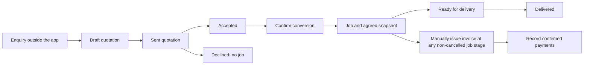
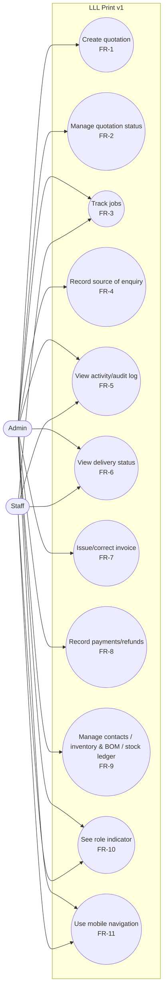

# Software Requirements Specification (SRS)

Project: LLL Print
Status: Draft — the current phase includes completing and reviewing the SRS
development baseline; it remains Draft until accepted.
Last updated: 2026-09-09

This document specifies what LLL Print must do: product context, v1
scope, and the functional/non-functional requirements derived from that
scope. It does not authorize implementation on its own — see
`docs/SPMP.md` for what's actually authorized at the current phase.

## 1. Product context

### Purpose

Settles LLL Print's product context, v1 scope, and requirements before
design work (`docs/SDD.md`) proceeds. Intended for anyone drafting or
reviewing design intent or implementation against the agreed v1 scope.

### Scope

- LLL Print is an original, independent web product for Malaysian
  print-shop operations.
- It provides one responsive operational workspace, usable across office
  desktop, supervisor tablet, and factory-floor mobile contexts, to
  replace manual, chat-based order handling with a structured quotation
  and job-tracking workflow — see § 2 for the full v1 capability list.
- It will not provide customer-facing tracking, a full accounting suite,
  or other capabilities listed as out of scope in § 3 for v1.
- `docs/SPMP.md` covers project management and phase authorization;
  `docs/SDD.md` covers design intent derived from this SRS.

### A typical order, in plain language

An Admin receives an enquiry for printed items outside the application.
They select the customer, enter the requested items, quantities, prices and
due date, and record where the enquiry came from. This creates a **quotation**:
an offer, not yet a production instruction or a payment record.

When the customer accepts, the Admin confirms conversion to a **job**. The
job preserves what was agreed so later edits cannot silently change the
production record. Production work progresses through the defined stages;
Admin and Staff can understand its current status from the job view. Their
responsibilities do not imply that prototype role labels enforce permissions.

After conversion creates a job, the Admin may deliberately create an
**invoice** before, during or after production, which records the full amount
due. A confirmed partial payment before production is a **deposit**: money
actually received, not merely requested. Each confirmed
**payment** reduces the outstanding balance. Finishing production, issuing
an invoice and receiving money are separate events.

This is the normal journey; FR-2, FR-3 and FR-8 define revisions,
cancellation, rework and payment voiding. The diagram does not add messaging,
automatic acceptance, or automatic invoice creation.

| Term | Meaning in LLL Print |
|---|---|
| Contact | A customer or supplier record used by operational documents |
| Quotation | The proposed items, quantities and price offered to a customer |
| Job | The production work created from an accepted quotation |
| Invoice | The issued record of the amount the customer owes |
| Payment | One confirmed receipt of money against an invoice |
| Refund | One confirmed return of previously received money, completed outside the application |
| Job billing record | The linked invoice versions, receipts and refunds for one job/customer; not a bank account or full accounting ledger |
| Inventory item | A material whose stock is tracked in a defined unit |
| BOM | A recipe describing material quantities per finished unit; it does not consume stock in v1 |
| Stock Ledger | The history explaining each manual change in material balance |

Inventory supports the order journey but is a separate workflow. Job
completion does not deduct stock in v1; an explicit manual stock movement
does. The system is not a full accounting package.

### Worked example: 100 printed shirts

This synthetic example explains the agreed flow; it is not product pricing
or real customer data. Size variants use separate lines under the existing
scope. Tax is zero for this example, not a tax-policy decision.

| Step | Action | Expected record/result |
|---|---|---|
| 1. Enquiry | Admin selects a customer and records the requested delivery date and enquiry source | One draft quotation |
| 2. Price | Enter 50 medium shirts and 50 large shirts, each at RM18.00 | Two lines of RM900.00; subtotal RM1,800.00 |
| 3. Review | Apply RM100.00 quotation discount and 0% tax | Grand total RM1,700.00; quantities remain 50 + 50 |
| 4. Agreement | Record sent, then accepted after the external customer response | Accepted quotation; no payment or job is implied by acceptance |
| 5. Production handoff | Confirm conversion | One linked job preserves both lines, quantities and RM1,700.00 agreed total |
| 6. Invoice | Admin deliberately issues an invoice from the pending job | One invoice for the full RM1,700.00, initially unpaid |
| 7. Deposit receipt | Confirm a RM700.00 bank-transfer payment actually received before production | Partially paid; balance RM1,000.00 |
| 8. Production | Progress the job through permitted stages and into ready for delivery | Visible production status and relevant activity entries; no second invoice or automatic stock movement |
| 9. Final receipt | Confirm RM1,000.00 against the same invoice | Paid; balance RM0.00; do not invoice the deposit again |
| 10. Delivery | Mark the ready job delivered when handover occurs | Delivered job; delivery does not change invoice or payment totals |

Payment and delivery timing are separate. This is one possible sequence,
not a requirement to pay a deposit before starting production or to pay in
full before delivery. The billing direction was expanded on 2026-09-09 to
support receipts before production. A configurable deposit request, percentage
schedule and automatic production/payment gate are not included.

Separately, an inventory item could have 150 blank shirts after a manual
stock-in. A manual stock-out of 100 leaves 50. A BOM recording one blank shirt
per finished shirt describes the recipe but does not post that stock-out.
Stock must not change a second time when the job is marked ready or delivered.

If the RM700.00 payment was entered incorrectly, voiding it with a reason
retains its history. With only the RM1,000.00 payment remaining, the balance
becomes RM700.00. No historical payment is overwritten.

### Release meaning

The current task is documentation. **v1** below describes a frontend
demonstration with synthetic data and display-only Admin/Staff labels.
**Real-data release** means a later persistent operational system. The
proposed security targets in §5 must be resolved and verified before that
release; prototype role display must never be presented as authentication.

### Intended users and responsibilities

Target device contexts: office desktop, supervisor tablet, factory-floor
mobile device. Applicable features must define behavior for all three.

| Role | What they need from the system |
|---|---|
| Admin | Oversee the business, receive customer orders, prepare quotations and job descriptions, manage orders end to end. |
| Staff | Carry out production work on orders (e.g. factory-floor tasks), under Admin's oversight. |
| Customer | View own order/production status via QR code, no login. Out of v1 scope — see § 3. |

The diagram in § 4 records intended responsibilities. Enforced, per-account
permissions are deferred to a later phase (§ 6). v1 only requires roles to be
visually distinguishable in the UI, not permission-enforced.

### Problem statement

Malaysian print shops need a practical way to coordinate operational work
across office, supervision, and production contexts without depending on
a desktop-only experience.

Today, orders are received and negotiated entirely through informal chat
(e.g. WhatsApp): a customer describes the order, quantity, and sizes in
conversation, and staff then manually re-write that conversation into a
quotation and job description. This manual re-entry is slow and
error-prone, and gives the customer no way to check order or production
progress without asking staff directly.

Success for LLL Print's v1 means:

- **Faster quotations** — creating a quotation/job description takes
  minutes, not manual re-typing from a chat conversation.
- **Fewer mistakes** — wrong quantity, size, or price errors drop because
  staff enter structured data instead of retyping from memory or chat.
- **Easier order tracking** — Admin sees all current orders and their
  status in one place, instead of scrolling through chat history.

Product principles guiding the requirements below:

- One responsive web application, not separate desktop and mobile
  products.
- Applicable features must define desktop, tablet, and mobile behavior.
- Localization defaults: MYR, `en-MY`, `Asia/Kuala_Lumpur`.
- Prototype behavior is not automatically a production requirement.

### Current technical direction

Frontend foundation: React, TypeScript, Vite, React Router, TanStack Query.

Planned later system direction: a modular monolith with a single-company
launch and tenant-ready ownership boundaries; planned backend technologies
are NestJS with Fastify, REST/OpenAPI, PostgreSQL, Prisma, pg-boss, and
S3-compatible object storage. These are planning inputs only — they do not
authorize backend, database, infrastructure, dependency, or deployment work
(see `docs/SDD.md`).

## 2. In scope

1. **Quotation form** — customer picker, structured item list, pricing,
   tax. Item rows must count as soon as they are filled in — no separate
   hidden "confirm" step, so the displayed total always reflects the entered
   line items.
2. **Explicit quotation status lifecycle** — draft → sent →
   accepted or declined; only accepted → converted-to-job. Not a single paid/unpaid flag.
3. **Job tracking board** — all jobs, current production stage, due date,
   status.
4. **Source-of-enquiry note** — a free-text field on each quotation
   recording where the order came from (e.g. "WhatsApp, 28 Aug"). Directly
   addresses the core problem: no current way to trace a quote back to the
   conversation it came from.
5. **Basic activity/audit log** — records who changed what, and when, on
   quotations and jobs.
6. **Visible delivery status** — a real, visible status on the job board,
   not hidden metadata.
7. **Manual invoice creation** — a separate, deliberate step from "job
   production complete," not automatically coupled. Issued corrections use
   linked replacements; cancellations use explicitly agreed settlement.
8. **Payment marking with confirmation** — recording a payment requires
   confirming amount/date, not a single unconfirmed click. Includes a deposit
   received before production against an already-issued invoice.
   Includes manual refund records and a separate cancellation settlement.
9. **Contacts (customers/suppliers), Inventory & BOM, Stock Ledger** — the
   current prototype screens, refined per the confirmed roles.
10. **Basic roles reflected in the UI** — Admin, Staff, at least visually
    distinct even if permission enforcement is not built yet.
11. **Mobile navigation fix** — 5-icon bottom nav with no overlap on the
    dashboard stats.
12. **Responsive desktop/tablet/mobile support** for all of the above.

## 3. Out of scope

Deferred to a later, separately authorized phase:

- Customer-facing QR order/production status tracking (needs a real
  backend)
- AI-assisted features (planning, rescue plans, translation) — if added
  later, must never present fabricated specifics as fact, and must be
  schema-validated with required user confirmation. AI output must remain an
  editable draft and must not directly post or change jobs, statuses, stock,
  payments, or customer communications.
- Full accounting suite (P&L, balance sheet, trial balance, tax filings)
- Enforced multi-staff permissions, including any per-stage staff assignment
- WhatsApp/payment-gateway integrations
- Platform administration / multi-company management
- Camera-based scanning — if added later, hardware-permission failures
  must be contained to the requesting feature and must never crash the
  whole application
- Automatic BOM deduction from job completion — v1 uses manual Stock Ledger
  movements only
- Production login, server-enforced identity, and secure audit attribution
- Variant and size breakdowns within one quotation line — use separate
  quotation lines instead
- Automated overdue reminders and payment collection
- Messaging integrations, subscription/platform-administration
  capabilities, advanced analytics
- Any claim of tax, accounting, PDPA, SST, MyInvois, security, or
  accessibility compliance

## 4. Functional requirements

### Use case diagram

The diagram distinguishes intended responsibilities: Admin oversees order,
commercial, contact, inventory, and stock work; Staff uses the production-
facing job and delivery views. Both can see their role indicator and use
mobile navigation. It is a responsibility model only: it does not guarantee
that every Staff account has the same access. Customer is intentionally
excluded: no v1 use case connects to it because QR order/production tracking
is deferred (§3).

### Use case summary

| Use case | Primary actor(s) | Requirement(s) |
|---|---|---|
| Create quotation | Admin | FR-1 |
| Manage quotation status | Admin | FR-2 |
| Track jobs | Admin, Staff when permitted | FR-3 |
| Record source of enquiry | Admin | FR-4 |
| View activity/audit log | Admin, Staff when permitted | FR-5 |
| View delivery status | Admin, Staff when permitted | FR-6 |
| Issue/correct invoice and settle cancellation | Admin | FR-7 |
| Record payments/refunds | Admin | FR-8 |
| Manage contacts / inventory & BOM / stock ledger | Admin | FR-9 |
| See role indicator | Admin, Staff | FR-10 |
| Use mobile navigation | Admin, Staff when permitted | FR-11 |

Actor-to-use-case assignment follows the role descriptions in § 1
("Intended users"). It documents intended responsibilities, rather than a
v1 access-control requirement. In a later authorized permissions phase,
Admin would retain business-level access and each Staff account would receive
its own configured module actions (FR-10.1, § 6 open item).

### FR-1 Quotation form (§2 item 1)

- FR-1.1 The system shall provide a quotation form with a customer picker.
- FR-1.2 The system shall allow a structured, itemized list of line items
  (not free text) on a quotation.
- FR-1.3 The system shall calculate pricing and tax from item data.
- FR-1.4 Each item row shall count toward the quotation total as soon as it
  is filled in. The system shall not require a separate, hidden
  confirmation step before an item row affects the total.
- FR-1.5 The system shall calculate each line total, quotation subtotal, tax
  amount, and grand total from the current quotation line items. Monetary
  calculations shall retain decimal precision and display MYR values rounded
  to two decimal places.
- FR-1.6 The system shall prevent a quotation from being sent unless it has a
  customer, document-level due date and source-of-enquiry note, and at least
  one complete line item with description, positive quantity, unit and unit price.
  All saved lines shall be complete before sending.
- FR-1.7 If a quotation create or update action fails validation, the system
  shall retain the entered values and show a clear, recoverable error.
- FR-1.8 The system shall provide an optional generic Tax field on each
  quotation. Unit prices shall be tax-exclusive. Tax shall default to 0%, and
  the user may enter the applicable rate for that quotation; the system shall
  calculate the tax amount from the discounted quotation subtotal and add it
  to the grand
  total. The system shall not label this field as SST or make a tax-compliance
  claim.
- FR-1.9 The system shall provide an optional quotation-level discount amount
  in MYR, defaulting to RM0.00. The discount shall not exceed the quotation
  subtotal. The system shall not support percentage, line-item, or stacked
  discounts in v1; the grand total shall equal subtotal minus discount plus
  tax.
- FR-1.10 The system shall use decimal arithmetic for quotation calculations,
  not binary floating-point arithmetic. It shall calculate and round each line
  total to two decimal places using half-up rounding; sum rounded line totals
  into the subtotal; apply the quotation discount; calculate and round tax to
  two decimal places; then calculate the grand total.
- FR-1.11 The system shall require each quotation line to have one positive
  quantity and a unit label, defaulting to unit.
- FR-1.12 A quotation-line quantity shall mean the number of finished items or
  service units ordered on that line, and the line total shall use that exact
  quantity.
- FR-1.13 The system shall copy each quotation-line quantity and unit into the
  job snapshot when the quotation is converted to a job.
- FR-1.14 The system shall allow incomplete drafts while clearly marking their
  totals provisional. Complete valid rows contribute immediately; invalid
  negative/out-of-range values shall not be silently accepted as zero.

### FR-2 Quotation status lifecycle (§2 item 2)

- FR-2.1 The system shall track quotation status through the explicit
  lifecycle: draft → sent → accepted or declined; accepted →
  converted-to-job.
- FR-2.2 The system shall not represent quotation status as a single
  paid/unpaid flag.
- FR-2.3 The system shall allow conversion to a job only from an accepted
  quotation. A declined quotation shall not be converted to a job.
- FR-2.4 The system shall show a confirmation that summarizes the quotation
  before converting it to a job.
- FR-2.5 The system shall allow a draft quotation to be edited.
- FR-2.6 The system shall not allow a sent, accepted or declined quotation to be edited
  directly. A change to these states shall create a new draft revision linked
  to the earlier quotation.
- FR-2.7 The system shall retain earlier quotation revisions in the quotation
  history.
- FR-2.8 The system shall allow conversion only when the latest revision in
  the quotation family is accepted. A newer draft, sent or declined revision
  shall block conversion of any older accepted revision.
- FR-2.9 The system shall create at most one job per quotation family. Once
  converted, the family shall not accept further edits, revisions or conversions;
  a repeat order shall start a new quotation family.
- FR-2.10 Only the latest revision may be edited or transitioned. Creating a
  revision shall preserve earlier history and require fresh acceptance of the
  new revision before conversion; it shall not inherit accepted status.
- FR-2.11 Sent, accepted and declined shall be explicitly recorded external
  events; the system shall not send a message or infer customer acceptance.

### FR-3 Job tracking board (§2 item 3)

- FR-3.1 The system shall display all jobs in one view.
- FR-3.2 Each job entry shall show its current production stage, due date,
  and status.
- FR-3.3 When an accepted quotation is converted to a job, the system shall
  preserve a job snapshot of the agreed customer, line items, quantities,
  prices, tax, totals, source-of-enquiry note, and relevant quotation notes.
- FR-3.4 The system shall track each job through the lifecycle: pending → in
  production → ready for delivery → delivered.
- FR-3.5 The system shall allow cancellation only from pending or in
  production, and shall require a cancellation reason.
- FR-3.6 The system shall not allow a delivered or cancelled job to return to
  an earlier status in v1.
- FR-3.7 The system shall require each job to show one current production
  stage selected from: preparation, production, quality check, or packing.
- FR-3.8 The system shall display the current production stage on the job
  tracking board.
- FR-3.9 The system shall allow a job to return to an earlier production
  stage only when the user supplies a rework reason.
- FR-3.10 A converted job shall start with pending status and preparation stage.
  Stage changes shall be allowed only while status is in production.
- FR-3.11 The system shall require packing stage before ready for delivery.
  Rework shall remain within an in-production job; a ready or delivered job
  shall not reopen through a stage action.
- FR-3.12 Within in-production jobs, forward stage changes may skip stages;
  the system shall not imply the skipped stages were completed. Backward
  changes require the rework reason specified in FR-3.9.

### FR-4 Source-of-enquiry note (§2 item 4)

- FR-4.1 The system shall provide a free-text field on each quotation
  recording where the order came from (e.g. "WhatsApp, 28 Aug").
- FR-4.2 The source-of-enquiry note shall be required before a quotation can
  be sent.

### FR-5 Activity/audit log (§2 item 5)

- FR-5.1 The v1 activity history shall record the current in-app role/profile
  label, timestamp, action, and changed information for the events in
  FR-5.2 and FR-5.4.
- FR-5.2 The system shall record quotation creation, update, sending,
  acceptance, decline, revision creation, and conversion to a job, plus job
  status and production-stage changes, payment recording, and payment voiding.
- FR-5.3 The v1 activity history shall not be presented as a secure identity
  audit trail. Production login and server-enforced identity are required
  before activity entries can be relied on for accountability.
- FR-5.4 The system shall also record invoice issue/replacement, cancellation
  settlement, refund recording and refund-record voiding, with reason and
  linked records for corrections, settlements and voids.

### FR-6 Delivery status (§2 item 6)

- FR-6.1 The system shall show delivery status as a visible field on the
  job board, not as hidden metadata.
- FR-6.2 The system shall use the visible delivery statuses: not ready, ready,
  delivered and not applicable (cancelled).
- FR-6.3 The delivery status shall be not ready while a job is pending or in
  production, ready when a job is ready for delivery, and delivered when a
  job is delivered. Live courier tracking is not included in v1.
- FR-6.4 A cancelled job shall display delivery as not applicable and retain
  its last production stage in history.

### FR-7 Manual invoice creation (§2 item 7)

- FR-7.1 The system shall require a separate, deliberate user action to
  create an invoice from a job.
- FR-7.2 The system shall not automatically create an invoice when a job is
  marked production-complete.
- FR-7.3 The system shall allow manual invoice creation for a job created
  from an accepted quotation when the job is pending, in production, ready
  for delivery or delivered. It shall reject initial invoice creation for a
  cancelled job or directly from a draft, sent or declined quotation.
  Replacement of an existing invoice for cancellation settlement follows FR-7.11.
- FR-7.4 When an invoice is created, the system shall preserve an invoice
  snapshot of the customer, line items, quantities, unit prices, discount,
  tax, and totals.
- FR-7.5 The system shall not allow an issued invoice to be edited or deleted
  in v1.
- FR-7.6 The system shall require each payable invoice to have a payment due
  date. The due date shall default to the invoice creation date, may be set to
  a later date, and shall not be earlier than the invoice creation date.
- FR-7.7 The system shall allow at most one active invoice per job, retaining
  all superseded invoices in the same job billing record. Receiving a deposit
  or balance payment shall not create another invoice.
- FR-7.8 The system shall correct an issued invoice only through a confirmed,
  separately numbered replacement linked to the original, preserving the
  original contents and marking it superseded.
- FR-7.9 Before replacement, the system shall show changes to billing details,
  lines, quantities, unit prices, discount, tax, due date and totals, alongside
  differences from the agreed job snapshot. Admin shall confirm the correction
  reason and record the basis of the customer agreement for commercial changes.
- FR-7.10 A replacement shall retain the same job and customer identity and
  shall not rewrite the job or earlier invoice snapshots. Changing the customer
  identity requires a separately scoped resolution, not reassignment of receipts.
- FR-7.11 For a cancelled job with an invoice, Admin shall explicitly confirm
  the agreed final charge and its reason/agreement note through a replacement
  invoice whose lines and totals represent that charge, including zero.
  Cancelling a job alone shall not change its billed amount.
- FR-7.12 A cancelled job with an invoice shall remain marked as requiring
  billing review until its cancellation settlement is explicitly recorded;
  an unchanged charge may be confirmed without issuing a redundant replacement.
- FR-7.13 Invoice replacement shall preserve original payment/refund links
  while applying their net amounts exactly once to the active invoice within
  the same job billing record. It shall not create fictitious receipts or refunds.

### FR-8 Payment marking with confirmation (§2 item 8)

- FR-8.1 The system shall require the user to confirm amount and date when
  recording a payment.
- FR-8.2 The system shall not record a payment from a single, unconfirmed
  click.
- FR-8.3 The system shall show a confirmation that summarizes the payment
  amount and date before recording it.
- FR-8.4 The system shall represent a zero-value active invoice with no net
  receipts as non-payable, not paid. If net receipts remain, it shall show the
  refund due instead of hiding it behind the zero invoice amount.
- FR-8.5 The system shall record each payment separately with its confirmed
  amount and date.
- FR-8.6 The system shall derive the active invoice's payment state from the
  job billing record: unpaid when net received is zero and the total is positive,
  partially paid when net received is between zero and the total, and paid when
  net received equals a positive total. Excess net received shall show refund
  due; a zero total with zero net received shall show non-payable.
- FR-8.7 The system shall not allow a recorded payment to be edited or
  deleted.
- FR-8.8 The system shall allow a recorded payment to be voided only when the
  user supplies a reason.
- FR-8.9 When a payment is voided, the system shall recalculate the invoice
  payment status from the remaining effective payments and refunds in the job
  billing record, using the settlement rules below.
- FR-8.10 The system shall prevent recorded payments from exceeding the
  active invoice's remaining amount due. A later invoice reduction may create
  a refund due without invalidating historical receipts. Formal credit-note
  documents and automatic transfer/gateway refunds remain out of scope;
  manually confirmed refund records are in scope.
- FR-8.11 The system shall require each payment to record one payment method:
  cash, bank transfer, e-wallet / QR, or other.
- FR-8.12 The system shall require a short payment-method note when other is
  selected.
- FR-8.13 The system shall show the remaining balance for each payable invoice
  after effective payments and refunds are taken into account, using FR-8.19.
- FR-8.14 The system shall allow a confirmed receipt before production to be
  recorded against the job's issued invoice using the same Payment records
  and balance calculation as later receipts. It shall not count a requested
  or promised deposit as money received.
- FR-8.15 The system shall retain the full invoice total when a deposit is
  received; it shall reduce only the remaining balance and shall not create
  a second invoice for that deposit or for the remaining balance.
- FR-8.16 The system shall require each payment amount to be positive and no
  greater than the invoice's remaining balance.
- FR-8.17 The system shall not use payment status alone to change a job's
  production or delivery status. A mandatory deposit threshold is out of scope.
- FR-8.18 Cancelling a job shall not void its invoice, erase its payments or
  record a refund. Existing balances and payment history shall remain visible
  for review; financial resolution after cancellation is a separate workflow.
- FR-8.19 The system shall calculate net received as effective payments minus
  effective refunds for the job billing record. Amount due shall be the greater
  of zero and active invoice total minus net received; refund due shall be the
  greater of zero and net received minus active invoice total.
- FR-8.20 Admin shall record a refund only after confirming that money was
  returned externally, with positive amount, actual date, method, reason,
  source payment and a transfer/receipt reference or cash acknowledgement note.
  A promise to refund shall remain a refund due, not a completed refund record.
- FR-8.21 A refund shall not exceed either the job's current refund due or
  the source payment's effective unrefunded amount. Refunds spanning multiple
  receipts shall use separate linked refund records.
- FR-8.22 A refund shall reference a non-voided payment in the same job/customer
  billing record. The system shall not transfer receipts between jobs or customers.
- FR-8.23 The system shall preserve posted refunds without edit/delete. A
  recording mistake may be voided with a reason and confirmation; this shall
  recalculate settlement and shall not claim money was recovered from a customer.
- FR-8.24 The system shall reject voiding a payment while it has effective
  linked refunds. Voids correct erroneous records only and shall not substitute
  for recording money actually returned.
- FR-8.25 Payment, refund, invoice-replacement and cancellation-settlement
  operations shall reject duplicate effects and stale/concurrent changes that
  would violate the same-job, active-invoice or refundable-amount rules.
- FR-8.26 Cancellation shall not apply an automatic forfeiture percentage or
  fee. The system shall record the charge agreed for that job, not decide the
  shop's commercial or legal entitlement to retain a deposit.
- FR-8.27 The system shall reject a refund date earlier than its source
  payment's actual date or later than the current local calendar date.

### FR-9 Contacts, Inventory & BOM, Stock Ledger (§2 item 9)

- FR-9.1 The system shall provide Contacts (customers/suppliers) screens,
  refined from the current prototype per confirmed roles.
- FR-9.2 The system shall provide Inventory & BOM (bill of materials)
  screens, refined from the current prototype per confirmed roles.
- FR-9.3 The system shall provide a Stock Ledger screen, refined from the
  current prototype per confirmed roles.
- FR-9.4 The system shall identify each contact as either a customer or a
  supplier.
- FR-9.5 The system shall require a contact display name and at least one
  contact method: phone or email. Address and internal notes shall be
  optional.
- FR-9.6 The system shall not send messages or record marketing consent in
  v1.
- FR-9.7 The system shall provide inventory items with a name, unit of
  measure, current balance, and optional category and supplier.
- FR-9.8 The Stock Ledger shall record manual stock-in, stock-out, and
  adjustment movements. Each movement shall record its item, quantity, date,
  reason, actor, and resulting balance.
- FR-9.9 The system shall not allow a posted stock movement to be edited or
  deleted. A correction shall use a linked reversal or adjustment movement.
- FR-9.10 Automatic BOM deduction when a job is completed is out of scope for
  v1. v1 stock changes use manual Stock Ledger movements only.
- FR-9.11 The system shall reject a stock-out or adjustment movement that
  would reduce an item's balance below zero in v1.
- FR-9.12 The system shall require each inventory item to use one unit of
  measure: unit, sheet, metre, kilogram, roll, or other.
- FR-9.13 The system shall require every stock movement for an item to use
  that item's unit of measure. Selecting other shall require a short custom
  unit label.
- FR-9.14 The system shall not allow an inventory item's unit of measure to
  change after it has stock movements. Unit conversion is out of scope for v1.
- FR-9.15 The system shall provide a BOM with a name that describes one
  finished print item or job item.
- FR-9.16 Each BOM component shall select an inventory item and a positive
  quantity required per finished unit. The component quantity shall use that
  inventory item's unit of measure.
- FR-9.17 The system shall allow a BOM to be edited while it has not been
  used for automatic stock deduction.
- FR-9.18 Creating or editing a BOM shall not change stock in v1.
- FR-9.19 An inventory item shall start with zero stock. Opening stock shall
  be recorded through a manual stock-in movement, never a direct balance edit.
- FR-9.20 Stock-in and stock-out shall use positive quantities; an adjustment
  shall use a nonzero signed difference. The confirmation shall show previous
  balance, signed change and resulting balance before posting.
- FR-9.21 A reversal shall negate the full quantity of one original non-reversal
  movement, reference it, and be permitted at most once. It shall reject a
  negative resulting balance and shall not erase the original movement.

### FR-10 Role display (§2 item 10)

- FR-10.1 The system shall visually distinguish the Admin and Staff roles
  in the UI. Permission enforcement is not required for v1.
- FR-10.2 The system shall show the current in-app role/profile label used by
  the v1 activity history. This label does not establish secure identity or
  permissions.

### FR-11 Mobile navigation fix (§2 item 11)

- FR-11.1 The system shall provide a 5-icon bottom navigation bar on mobile.
- FR-11.2 The bottom navigation bar shall not overlap dashboard stats.

### Cross-cutting acceptance checks

#### Quotations

- A quotation with a missing customer, due date, source-of-enquiry note, or
  complete line item cannot be sent, and the user can correct the highlighted
  information without re-entering the rest of the quotation.
- A quotation with no entered tax rate shows 0% tax; an entered tax rate is
  reflected in the calculated tax amount and grand total, which equals the
  discounted tax-exclusive subtotal plus tax.
- A quotation-level discount is deducted before tax is calculated, cannot
  exceed the subtotal, and is reflected in the grand total.
- Quotation calculations use the approved order: rounded line totals, subtotal,
  discount, rounded tax, then grand total.
- Each quotation line uses one positive quantity and unit; variant or size
  breakdowns are represented as separate quotation lines in v1.
- A declined quotation cannot be converted to a job; an accepted quotation
  can be converted only after the user confirms the shown summary.
- Revising a sent, accepted or declined quotation creates a linked draft;
  only the latest revision, itself accepted, may convert. A newer draft blocks
  the old acceptance. After conversion, another conversion/revision of that
  family is rejected; a repeat order uses a new family.

#### Jobs and delivery

- A converted job retains its quotation snapshot if the source quotation is
  later changed.
- A job can progress from pending to in production, ready for delivery, and
  delivered in order. Cancellation is available only while pending or in
  production and requires a reason; delivered and cancelled jobs cannot be
  moved back to an earlier status.
- Each job shows one of the approved production stages on the job board:
  preparation, production, quality check, or packing.
- Returning a job to an earlier production stage requires a rework reason and
  is recorded in the activity log.
- A new job starts pending/preparation. Stage changes require in-production
  status; readiness requires packing. Ready/delivered jobs cannot reopen.
- The job board visibly shows not ready, ready, delivered or not applicable
  for cancellation, consistently with the job lifecycle.

#### Invoices and payments

- An invoice can be created manually from a pending, in-production, ready or
  delivered job created from an accepted quotation. A cancelled job cannot
  receive an initial invoice; an existing invoice may be replaced through
  cancellation settlement. Production completion never automatically issues one.
- A RM700.00 pre-production receipt against RM1,700.00 leaves RM1,000.00 due;
  a later RM1,000.00 receipt settles the same invoice. Promised deposits do not
  change the balance, and payment does not advance production status.
- Cancellation after a receipt retains the invoice and payment history;
  no automatic refund, invoice void or payment deletion occurs.
- An issued invoice retains its customer, items, quantities, prices, discount,
  tax, and totals if the related job or quotation changes later.
- A payable invoice has a due date no earlier than its creation date and shows
  its remaining balance after effective payments and refunds.
- A job cannot have two active invoices. A correction retains the superseded
  invoice and links its replacement; existing receipts count once toward the
  current balance without changing their original invoice references.
- The activity history identifies the current in-app role/profile label, time,
  and action for the events listed in FR-5.2/FR-5.4, and does not claim secure
  identity attribution.
- A payment is not recorded until its amount and date are confirmed; a
  zero-value invoice is visibly non-payable.
- An active invoice shows unpaid, partially paid, paid, non-payable or refund
  due according to its total and net effective receipts after refunds.
- A recorded payment cannot be edited or deleted. A voided payment requires a
  reason, is recorded in the activity log, and recalculates the invoice status;
  a payment that would exceed the invoice total is rejected.
- Each payment records its method; selecting other requires a short note.
- With RM700.00 received, replacing RM1,700.00 with RM1,500.00 leaves RM800.00
  due. Replacing it with RM500.00 instead leaves RM200.00 refund due; recording
  the actual RM200.00 refund settles that RM500.00 charge.
- Cancelling after RM700.00 received and confirming RM200.00 as the agreed
  final charge leaves RM500.00 refund due. Recording that external refund leaves
  RM200.00 net received, zero amount due and zero refund due. A zero final
  charge instead requires the full RM700.00 refund to settle.
- A refund promise does not change net receipts. Reject an excessive refund,
  wrong-job source payment, duplicate refund, stale correction and payment void
  with an effective linked refund. Preserve original invoice and job snapshots.

#### Contacts, inventory, BOM, and Stock Ledger

- A contact cannot be saved without a display name and at least one phone
  number or email address; address and internal notes may be left empty.
- An item begins at zero; opening stock posts a movement. Signed adjustment
  and full reversal previews agree with the resulting balance; a second reversal,
  reversal of a reversal and a negative resulting balance are rejected.
- A stock-in, stock-out, or adjustment movement shows its item, quantity,
  date, reason, actor, and resulting balance. A posted movement cannot be
  edited or deleted; a correction creates a linked reversal or adjustment.
- A stock-out or adjustment that would make an item's balance negative is
  rejected.
- Inventory movements use the item's selected unit. A unit cannot be changed
  after movements exist, and selecting other requires a custom unit label.
- A BOM component requires an inventory item and a positive quantity in that
  item's unit. Creating or editing a BOM does not change stock.
- A saved Contact is visibly identified as either a customer or supplier.

#### Roles and mobile navigation

- The UI visibly distinguishes Admin and Staff and shows the current in-app
  role/profile label without implying secure identity or permission enforcement.
- On mobile, the five-icon bottom navigation bar does not overlap dashboard
  statistics, form fields, or action buttons.

## 5. Non-functional requirements

### NFR-1 Responsive support (§2 item 12)

- NFR-1.1 Every FR above shall define and support its behavior on desktop,
  tablet, and mobile.
- NFR-1.2 LLL Print shall remain one responsive web application, not
  separate desktop and mobile products.
- NFR-1.3 On mobile, quotation, job, invoice, contact, inventory, and Stock
  Ledger lists shall use a readable card or list layout rather than require a
  wide table.
- NFR-1.4 On mobile, forms shall use a single-column layout and the bottom
  navigation shall not cover fields or action buttons.
- NFR-1.5 On desktop and tablet, tables may be used when all required
  information and actions remain visible.
- NFR-1.6 Each interactive control shall have a visible text label or
  accessible name, and status shall not be communicated by colour alone.

### NFR-2 Localization

- NFR-2.1 The system shall default currency formatting to MYR.
- NFR-2.2 The system shall default locale to `en-MY`.
- NFR-2.3 The system shall default timezone to `Asia/Kuala_Lumpur`.

### NFR-3 Maintainability — planning requirements

Requested 2026-09-08 for later implementation. These requirements do not
authorize refactoring the existing prototype during documentation work.

- NFR-3.1 Each feature shall keep its screens, feature-specific components,
  data access and business rules in separately identifiable units, following
  SDD §2. App entry points shall compose features rather than implement them.
- NFR-3.2 Money calculations and lifecycle rules shall be testable without
  rendering a page or starting a server.
- NFR-3.3 Frontend screens shall access data through an explicit feature
  interface so mock data can be replaced without rewriting screen logic.
- NFR-3.4 Each delivered journey shall identify its SRS requirements and
  include verification of its calculations, transitions and failure paths.

### NFR-4 Security — proposed real-data release targets

Security planning was requested on 2026-09-08. The following are proposed
acceptance targets for the later persistent system, not implemented controls
or an expansion of the display-only prototype. Agree their detailed design
before backend implementation; verify them before using real business data.

| ID | Proposed target | Required verification |
|---|---|---|
| SEC-1 | Protected business operations require authenticated identity and server-side permission checks on every request, with denial by default | Direct API requests from signed-out and unauthorized accounts cannot read or change protected records |
| SEC-2 | The server enforces record ownership and ignores client-supplied identity or role as proof of access | Changing a record identifier, role field or ownership field cannot bypass access restrictions; test cross-company access if company ownership is introduced |
| SEC-3 | Production sessions use encrypted transport, expire and can be revoked; browser session design includes appropriate cookie and CSRF controls | Expired/revoked sessions fail; logout invalidates access; test cross-site requests for cookie-authenticated writes |
| SEC-4 | Secrets remain outside Git, browser bundles and logs; diagnostics omit passwords, session tokens and unnecessary personal data | Inspect built assets/configuration and representative failure logs with synthetic credentials |
| SEC-5 | The server validates inputs, recalculates commercial values and rejects illegal lifecycle changes independently of the frontend | Tampered totals, invalid transitions and malformed requests fail without partial writes |
| SEC-6 | Sensitive writes resist duplicate requests and concurrent updates; protected history identifies the authenticated actor | Retried conversion/payment/stock actions do not duplicate effects; competing updates cannot silently overwrite records |
| SEC-7 | Security review and recovery checks are release conditions | Review dependencies and application access paths, resolve release-blocking findings, and demonstrate backup restoration against agreed recovery targets |

Security guidance: [OWASP Authorization](https://cheatsheetseries.owasp.org/cheatsheets/Authorization_Cheat_Sheet.html),
[Session Management](https://cheatsheetseries.owasp.org/cheatsheets/Session_Management_Cheat_Sheet.html)
and [Secrets Management](https://cheatsheetseries.owasp.org/cheatsheets/Secrets_Management_Cheat_Sheet.html).
These inform the design; their inclusion is not a security certification.

## 6. Open items

### Consolidated business decisions

The user accepted D1, D2, D4 and D5 together on 2026-09-09. D3 was accepted
through the billing planning batches. Their applicable rules are incorporated
into the requirements and SDD. Documents remain Draft pending overall review;
this approval does not authorize coding or make prototype permissions secure.

| ID | Accepted direction | Implementation dependency |
|---|---|---|
| D1 | One job per quotation family. Only the latest revision, itself accepted, may convert. Repeat orders use a new family. | FR-2.8–FR-2.11 and contract |
| D2 | Production: start pending/preparation; stage changes occur while in production; require packing before marking ready. Cancelling displays delivery as not applicable and retains the last stage for history. Rework remains within in-production jobs; ready/delivered jobs do not silently reopen. | Job transition table and board actions |
| D3 | Direction expanded 2026-09-09: pre-production receipts, controlled invoice replacement, manual confirmed refunds and explicit cancellation settlement. FR-7/FR-8 now define these workflows. No automatic transfers or deposit-forfeiture policy. | Exact billing API/schema and acceptance implementation |
| D4 | Zero opening balance; stock-in/out positive, adjustments signed; preview balance effect; full linked reversal once with no negative balance. | FR-9.19–FR-9.21 and contract |
| D5 | Future Staff access: start new accounts with no granted actions, then let Admin grant production access individually. Financial/customer details are withheld unless explicitly granted. Keep individual configuration; no automatic production template is introduced. | Real-data authorization matrix; prototype labels are unchanged |

### Invoice correction and cancellation settlement — D3-C

The manual-refund planning expansion on 2026-09-09 supersedes the earlier
no-payment-history-only correction proposal. FR-7/FR-8 are authoritative.
These are operational records; formal tax documents, legal entitlement to
retain a deposit and accounting compliance are not established by this design.

| Situation | Admin action | Result |
|---|---|---|
| Wrong issued invoice, no receipts | Review corrected values, reason and agreement; confirm replacement | Original remains readable, one new active invoice, amount due from corrected total |
| Wrong issued invoice, receipts exist | Same replacement process, showing net receipts and resulting amount/refund due | Receipts remain attached to their original invoice and count once within the same job billing record |
| Cancelled job with invoice | Review cancellation charge agreed with customer; confirm unchanged charge or replacement with agreed lines/total | No automatic retention/refund; active total determines amount due or refund due |
| Refund due | Return money outside the app, then confirm a linked refund record | Net received reduces; refund due reduces; no gateway call |
| Mistaken payment/refund entry | Review history and reasoned record void, subject to dependency checks | Original retained; balances recomputed; no claim of an actual money transfer |

A cancelled job with no invoice and no receipts has nothing to refund or
settle financially. Creating a new cancellation fee without an existing
invoice is not included. Cross-customer corrections, cross-job credit balances,
formal credit notes and automated refunds remain deferred. Before real-data
release, separately validate required document and retention obligations;
this operational design makes no tax/accounting compliance claim.

### Validation baseline for the screen walkthrough

The SDD §5 contract baseline defines numeric precision, maximum values,
required/nullable fields and error behaviour for the planned implementation.
These technical limits preserve the calculation and immutability rules;
frontends and backend must validate the same limits.

| Area | Baseline detail | Existing requirements retained |
|---|---|---|
| Quotation header | Due date and enquiry source are document fields, not required on every line; sent/accepted are Admin-recorded external events, with no message sent by the app | Customer, due date, source and one complete line required before sent; FR-1.6, FR-4 |
| Price/quantity | Non-negative unit price and discount; tax 0–100%; quantity positive with at most 3 decimal places; money inputs at most 2 decimal places | Decimal arithmetic and half-up calculation order; discount cannot exceed subtotal; FR-1.8–FR-1.13 |
| Payment | Positive amount no greater than remaining balance; reject future payment dates; allow a past actual receipt date | Explicit confirmation, separate immutable records and reasoned void; FR-8 |
| Stock/BOM | Positive in/out/component quantities with at most 3 decimal places; adjustments are nonzero signed differences under D4 | One unit per item, no negative balance and no automatic BOM deduction; FR-9 |
| Referenced records | No delete endpoint for referenced contacts/items; archive/inactive UI remains deferred | Do not delete historical commercial or ledger evidence |

### Technical decisions before real-data development

- Agree NFR-4 targets, select authentication/session implementation, and map
  D5 grants to named operations such as convert, issue, record, void and post.
- SDD §4 defines company ownership and same-company reference constraints;
  bind that model to authenticated membership before real-data deployment.
  Single-company launch does not imply multi-company management UI.
- SDD §§4–5 now specify business API schemas, precision/constraints, payload
  limits, pagination, idempotency and conflict behaviour. Login/grant endpoints,
  rate limits and deployable schema migrations remain backend design work.
- Agree backup retention, acceptable data loss and recovery time; verify a
  restore before real-data use. No numerical target is assumed here.
- Prototype refresh/reset behaviour, screen states and test mapping now have
  a proposed design in SDD §5; they do not require production infrastructure.

### Existing scope decisions

- Complete detailed screen fields, filters and validation incrementally in
  this planning work before each dependent implementation task.
- Cross-cutting acceptance checks are recorded in § 4. Full traceability from
  user problem through requirement, planned API operation, database
  transaction, and acceptance test is to be completed per journey before
  its implementation; API/database links remain design artifacts per
  `docs/SDD.md`.
- **Decided 2026-09-02:** Role permissions beyond visual distinction
  (FR-10) stay out of scope for v1 — Identity/Roles remains a
  frontend-only display concern; see `docs/SDD.md` § 8.
- **Deferred design direction 2026-09-08:** If permission enforcement is
  authorized later, configure it as a per-module matrix of View, Add, Edit,
  and Delete actions. Admin retains business-level access; every Staff
  account is configured individually, including any financial access. This
  does not change v1 scope or authorize login, authentication, or enforcement.
  These generic actions must map to explicit business operations such as
  conversion, invoice issue, payment void and stock posting. A permission
  must never override immutable-record or lifecycle rules.
- **Reviewed 2026-09-08:** The existing requirements for exact quantity
  preservation, visible save errors, payment-derived invoice status, and an
  immutable manual Stock Ledger with reversals remain deliberate v1 controls.
  They must not be weakened when the detailed screen requirements are added.
- Production login and secure audit attribution — deferred with server-side
  identity and permission enforcement.
- Highest-priority user problems beyond the core manual-order-intake
  problem — not yet identified.
