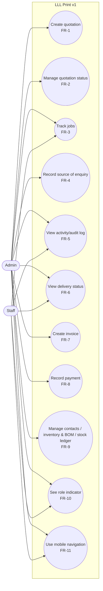

# Software Requirements Specification (SRS)

Project: LLL Print
Status: Draft — the current phase includes completing and reviewing the SRS
development baseline; it remains Draft until accepted.
Last updated: 2026-09-08

This document specifies what LLL Print must do: product context, v1
scope, and the functional/non-functional requirements derived from that
scope. It does not authorize implementation on its own — see
`docs/SPMP.md` for what's actually authorized at the current phase.

## 1. Product context

### Purpose

Settles LLL Print's product context, v1 scope, and requirements before
design work (`docs/SDD.md`) proceeds. Intended for anyone drafting or
reviewing design intent or implementation against the agreed v1 scope.

### Scope

- LLL Print is an original, independent web product for Malaysian
  print-shop operations.
- It provides one responsive operational workspace, usable across office
  desktop, supervisor tablet, and factory-floor mobile contexts, to
  replace manual, chat-based order handling with a structured quotation
  and job-tracking workflow — see § 2 for the full v1 capability list.
- It will not provide customer-facing tracking, a full accounting suite,
  or other capabilities listed as out of scope in § 3 for v1.
- `docs/SPMP.md` covers project management and phase authorization;
  `docs/SDD.md` covers design intent derived from this SRS.

### Intended users

Target device contexts: office desktop, supervisor tablet, factory-floor
mobile device. Applicable features must define behavior for all three.

| Role | What they need from the system |
|---|---|
| Admin | Oversee the business, receive customer orders, prepare quotations and job descriptions, manage orders end to end. |
| Staff | Carry out production work on orders (e.g. factory-floor tasks), under Admin's oversight. |
| Customer | View own order/production status via QR code, no login. Out of v1 scope — see § 3. |

The diagram in § 4 records intended responsibilities. Enforced, per-account
permissions are deferred to a later phase (§ 6). v1 only requires roles to be
visually distinguishable in the UI, not permission-enforced.

### Problem statement

Malaysian print shops need a practical way to coordinate operational work
across office, supervision, and production contexts without depending on
a desktop-only experience.

Today, orders are received and negotiated entirely through informal chat
(e.g. WhatsApp): a customer describes the order, quantity, and sizes in
conversation, and staff then manually re-write that conversation into a
quotation and job description. This manual re-entry is slow and
error-prone, and gives the customer no way to check order or production
progress without asking staff directly.

Success for LLL Print's v1 means:

- **Faster quotations** — creating a quotation/job description takes
  minutes, not manual re-typing from a chat conversation.
- **Fewer mistakes** — wrong quantity, size, or price errors drop because
  staff enter structured data instead of retyping from memory or chat.
- **Easier order tracking** — Admin sees all current orders and their
  status in one place, instead of scrolling through chat history.

Product principles guiding the requirements below:

- One responsive web application, not separate desktop and mobile
  products.
- Applicable features must define desktop, tablet, and mobile behavior.
- Localization defaults: MYR, `en-MY`, `Asia/Kuala_Lumpur`.
- Prototype behavior is not automatically a production requirement.

### Current technical direction

Frontend foundation: React, TypeScript, Vite, React Router, TanStack Query.

Planned later system direction: a modular monolith with a single-company
launch and tenant-ready ownership boundaries; planned backend technologies
are NestJS with Fastify, REST/OpenAPI, PostgreSQL, Prisma, pg-boss, and
S3-compatible object storage. These are planning inputs only — they do not
authorize backend, database, infrastructure, dependency, or deployment work
(see `docs/SDD.md`).

## 2. In scope

1. **Quotation form** — customer picker, structured item list, pricing,
   tax. Item rows must count as soon as they are filled in — no separate
   hidden "confirm" step, so the displayed total always reflects the entered
   line items.
2. **Explicit quotation status lifecycle** — draft → sent →
   accepted/declined → converted-to-job. Not a single paid/unpaid flag.
3. **Job tracking board** — all jobs, current production stage, due date,
   status.
4. **Source-of-enquiry note** — a free-text field on each quotation
   recording where the order came from (e.g. "WhatsApp, 28 Aug"). Directly
   addresses the core problem: no current way to trace a quote back to the
   conversation it came from.
5. **Basic activity/audit log** — records who changed what, and when, on
   quotations and jobs.
6. **Visible delivery status** — a real, visible status on the job board,
   not hidden metadata.
7. **Manual invoice creation** — a separate, deliberate step from "job
   production complete," not automatically coupled.
8. **Payment marking with confirmation** — recording a payment requires
   confirming amount/date, not a single unconfirmed click.
9. **Contacts (customers/suppliers), Inventory & BOM, Stock Ledger** — the
   current prototype screens, refined per the confirmed roles.
10. **Basic roles reflected in the UI** — Admin, Staff, at least visually
    distinct even if permission enforcement is not built yet.
11. **Mobile navigation fix** — 5-icon bottom nav with no overlap on the
    dashboard stats.
12. **Responsive desktop/tablet/mobile support** for all of the above.

## 3. Out of scope

Deferred to a later, separately authorized phase:

- Customer-facing QR order/production status tracking (needs a real
  backend)
- AI-assisted features (planning, rescue plans, translation) — if added
  later, must never present fabricated specifics as fact, and must be
  schema-validated with required user confirmation. AI output must remain an
  editable draft and must not directly post or change jobs, statuses, stock,
  payments, or customer communications.
- Full accounting suite (P&L, balance sheet, trial balance, tax filings)
- Enforced multi-staff permissions, including any per-stage staff assignment
- WhatsApp/payment-gateway integrations
- Platform administration / multi-company management
- Camera-based scanning — if added later, hardware-permission failures
  must be contained to the requesting feature and must never crash the
  whole application
- Automatic BOM deduction from job completion — v1 uses manual Stock Ledger
  movements only
- Production login, server-enforced identity, and secure audit attribution
- Variant and size breakdowns within one quotation line — use separate
  quotation lines instead
- Automated overdue reminders and payment collection
- Messaging integrations, subscription/platform-administration
  capabilities, advanced analytics
- Any claim of tax, accounting, PDPA, SST, MyInvois, security, or
  accessibility compliance

## 4. Functional requirements

### Use case diagram

The diagram distinguishes intended responsibilities: Admin oversees order,
commercial, contact, inventory, and stock work; Staff uses the production-
facing job and delivery views. Both can see their role indicator and use
mobile navigation. It is a responsibility model only: it does not guarantee
that every Staff account has the same access. Customer is intentionally
excluded: no v1 use case connects to it because QR order/production tracking
is deferred (§3).

### Use case summary

| Use case | Primary actor(s) | Requirement(s) |
|---|---|---|
| Create quotation | Admin | FR-1 |
| Manage quotation status | Admin | FR-2 |
| Track jobs | Admin, Staff when permitted | FR-3 |
| Record source of enquiry | Admin | FR-4 |
| View activity/audit log | Admin, Staff when permitted | FR-5 |
| View delivery status | Admin, Staff when permitted | FR-6 |
| Create invoice | Admin | FR-7 |
| Record payment | Admin | FR-8 |
| Manage contacts / inventory & BOM / stock ledger | Admin | FR-9 |
| See role indicator | Admin, Staff | FR-10 |
| Use mobile navigation | Admin, Staff when permitted | FR-11 |

Actor-to-use-case assignment follows the role descriptions in § 1
("Intended users"). It documents intended responsibilities, rather than a
v1 access-control requirement. In a later authorized permissions phase,
Admin would retain business-level access and each Staff account would receive
its own configured module actions (FR-10.1, § 6 open item).

### FR-1 Quotation form (§2 item 1)

- FR-1.1 The system shall provide a quotation form with a customer picker.
- FR-1.2 The system shall allow a structured, itemized list of line items
  (not free text) on a quotation.
- FR-1.3 The system shall calculate pricing and tax from item data.
- FR-1.4 Each item row shall count toward the quotation total as soon as it
  is filled in. The system shall not require a separate, hidden
  confirmation step before an item row affects the total.
- FR-1.5 The system shall calculate each line total, quotation subtotal, tax
  amount, and grand total from the current quotation line items. Monetary
  calculations shall retain decimal precision and display MYR values rounded
  to two decimal places.
- FR-1.6 The system shall prevent a quotation from being sent unless it has a
  customer and at least one complete line item with a description, quantity,
  unit price, a due date, and a source-of-enquiry note.
- FR-1.7 If a quotation create or update action fails validation, the system
  shall retain the entered values and show a clear, recoverable error.
- FR-1.8 The system shall provide an optional generic Tax field on each
  quotation. Unit prices shall be tax-exclusive. Tax shall default to 0%, and
  the user may enter the applicable rate for that quotation; the system shall
  calculate the tax amount from the discounted quotation subtotal and add it
  to the grand
  total. The system shall not label this field as SST or make a tax-compliance
  claim.
- FR-1.9 The system shall provide an optional quotation-level discount amount
  in MYR, defaulting to RM0.00. The discount shall not exceed the quotation
  subtotal. The system shall not support percentage, line-item, or stacked
  discounts in v1; the grand total shall equal subtotal minus discount plus
  tax.
- FR-1.10 The system shall use decimal arithmetic for quotation calculations,
  not binary floating-point arithmetic. It shall calculate and round each line
  total to two decimal places using half-up rounding; sum rounded line totals
  into the subtotal; apply the quotation discount; calculate and round tax to
  two decimal places; then calculate the grand total.
- FR-1.11 The system shall require each quotation line to have one positive
  quantity and a unit label, defaulting to unit.
- FR-1.12 A quotation-line quantity shall mean the number of finished items or
  service units ordered on that line, and the line total shall use that exact
  quantity.
- FR-1.13 The system shall copy each quotation-line quantity and unit into the
  job snapshot when the quotation is converted to a job.

### FR-2 Quotation status lifecycle (§2 item 2)

- FR-2.1 The system shall track quotation status through the explicit
  lifecycle: draft → sent → accepted or declined; accepted →
  converted-to-job.
- FR-2.2 The system shall not represent quotation status as a single
  paid/unpaid flag.
- FR-2.3 The system shall allow conversion to a job only from an accepted
  quotation. A declined quotation shall not be converted to a job.
- FR-2.4 The system shall show a confirmation that summarizes the quotation
  before converting it to a job.
- FR-2.5 The system shall allow a draft quotation to be edited.
- FR-2.6 The system shall not allow a sent or accepted quotation to be edited
  directly. A change to either status shall create a new draft revision linked
  to the earlier quotation.
- FR-2.7 The system shall retain earlier quotation revisions in the quotation
  history.
- FR-2.8 The system shall allow conversion to a job only from the latest
  accepted revision of a quotation.

### FR-3 Job tracking board (§2 item 3)

- FR-3.1 The system shall display all jobs in one view.
- FR-3.2 Each job entry shall show its current production stage, due date,
  and status.
- FR-3.3 When an accepted quotation is converted to a job, the system shall
  preserve a job snapshot of the agreed customer, line items, quantities,
  prices, tax, totals, source-of-enquiry note, and relevant quotation notes.
- FR-3.4 The system shall track each job through the lifecycle: pending → in
  production → ready for delivery → delivered.
- FR-3.5 The system shall allow cancellation only from pending or in
  production, and shall require a cancellation reason.
- FR-3.6 The system shall not allow a delivered or cancelled job to return to
  an earlier status in v1.
- FR-3.7 The system shall require each job to show one current production
  stage selected from: preparation, production, quality check, or packing.
- FR-3.8 The system shall display the current production stage on the job
  tracking board.
- FR-3.9 The system shall allow a job to return to an earlier production
  stage only when the user supplies a rework reason.

### FR-4 Source-of-enquiry note (§2 item 4)

- FR-4.1 The system shall provide a free-text field on each quotation
  recording where the order came from (e.g. "WhatsApp, 28 Aug").
- FR-4.2 The source-of-enquiry note shall be required before a quotation can
  be sent.

### FR-5 Activity/audit log (§2 item 5)

- FR-5.1 The v1 activity history shall record the current in-app role/profile
  label, timestamp, action, and changed information for changes to quotations
  and jobs.
- FR-5.2 The system shall record quotation creation, update, sending,
  acceptance, decline, revision creation, and conversion to a job, plus job
  status and production-stage changes, payment recording, and payment voiding.
- FR-5.3 The v1 activity history shall not be presented as a secure identity
  audit trail. Production login and server-enforced identity are required
  before activity entries can be relied on for accountability.

### FR-6 Delivery status (§2 item 6)

- FR-6.1 The system shall show delivery status as a visible field on the
  job board, not as hidden metadata.
- FR-6.2 The system shall use the visible delivery statuses: not ready, ready,
  and delivered.
- FR-6.3 The delivery status shall be not ready while a job is pending or in
  production, ready when a job is ready for delivery, and delivered when a
  job is delivered. Live courier tracking is not included in v1.

### FR-7 Manual invoice creation (§2 item 7)

- FR-7.1 The system shall require a separate, deliberate user action to
  create an invoice from a job.
- FR-7.2 The system shall not automatically create an invoice when a job is
  marked production-complete.
- FR-7.3 The system shall allow invoice creation only when a job is ready for
  delivery or delivered.
- FR-7.4 When an invoice is created, the system shall preserve an invoice
  snapshot of the customer, line items, quantities, unit prices, discount,
  tax, and totals.
- FR-7.5 The system shall not allow an issued invoice to be edited or deleted
  in v1.
- FR-7.6 The system shall require each payable invoice to have a payment due
  date. The due date shall default to the invoice creation date, may be set to
  a later date, and shall not be earlier than the invoice creation date.
- FR-7.7 The system shall allow only one invoice per job in v1. That invoice
  may receive multiple payment records.

### FR-8 Payment marking with confirmation (§2 item 8)

- FR-8.1 The system shall require the user to confirm amount and date when
  recording a payment.
- FR-8.2 The system shall not record a payment from a single, unconfirmed
  click.
- FR-8.3 The system shall show a confirmation that summarizes the payment
  amount and date before recording it.
- FR-8.4 The system shall represent a zero-value invoice as non-payable and
  shall not silently mark it as paid.
- FR-8.5 The system shall record each payment separately with its confirmed
  amount and date.
- FR-8.6 For a payable invoice, the system shall show an unpaid status before
  any payment is recorded, a partially paid status when recorded payments are
  less than the invoice total, and a paid status when recorded payments equal
  the invoice total.
- FR-8.7 The system shall not allow a recorded payment to be edited or
  deleted.
- FR-8.8 The system shall allow a recorded payment to be voided only when the
  user supplies a reason.
- FR-8.9 When a payment is voided, the system shall recalculate the invoice
  payment status from its remaining recorded payments.
- FR-8.10 The system shall prevent recorded payments from exceeding the
  payable invoice total in v1. Refunds and credit notes are out of scope.
- FR-8.11 The system shall require each payment to record one payment method:
  cash, bank transfer, e-wallet / QR, or other.
- FR-8.12 The system shall require a short payment-method note when other is
  selected.
- FR-8.13 The system shall show the remaining balance for each payable invoice
  after recorded payments are taken into account.

### FR-9 Contacts, Inventory & BOM, Stock Ledger (§2 item 9)

- FR-9.1 The system shall provide Contacts (customers/suppliers) screens,
  refined from the current prototype per confirmed roles.
- FR-9.2 The system shall provide Inventory & BOM (bill of materials)
  screens, refined from the current prototype per confirmed roles.
- FR-9.3 The system shall provide a Stock Ledger screen, refined from the
  current prototype per confirmed roles.
- FR-9.4 The system shall identify each contact as either a customer or a
  supplier.
- FR-9.5 The system shall require a contact display name and at least one
  contact method: phone or email. Address and internal notes shall be
  optional.
- FR-9.6 The system shall not send messages or record marketing consent in
  v1.
- FR-9.7 The system shall provide inventory items with a name, unit of
  measure, current balance, and optional category and supplier.
- FR-9.8 The Stock Ledger shall record manual stock-in, stock-out, and
  adjustment movements. Each movement shall record its item, quantity, date,
  reason, actor, and resulting balance.
- FR-9.9 The system shall not allow a posted stock movement to be edited or
  deleted. A correction shall use a linked reversal or adjustment movement.
- FR-9.10 Automatic BOM deduction when a job is completed is out of scope for
  v1. v1 stock changes use manual Stock Ledger movements only.
- FR-9.11 The system shall reject a stock-out or adjustment movement that
  would reduce an item's balance below zero in v1.
- FR-9.12 The system shall require each inventory item to use one unit of
  measure: unit, sheet, metre, kilogram, roll, or other.
- FR-9.13 The system shall require every stock movement for an item to use
  that item's unit of measure. Selecting other shall require a short custom
  unit label.
- FR-9.14 The system shall not allow an inventory item's unit of measure to
  change after it has stock movements. Unit conversion is out of scope for v1.
- FR-9.15 The system shall provide a BOM with a name that describes one
  finished print item or job item.
- FR-9.16 Each BOM component shall select an inventory item and a positive
  quantity required per finished unit. The component quantity shall use that
  inventory item's unit of measure.
- FR-9.17 The system shall allow a BOM to be edited while it has not been
  used for automatic stock deduction.
- FR-9.18 Creating or editing a BOM shall not change stock in v1.

### FR-10 Role display (§2 item 10)

- FR-10.1 The system shall visually distinguish the Admin and Staff roles
  in the UI. Permission enforcement is not required for v1.
- FR-10.2 The system shall show the current in-app role/profile label used by
  the v1 activity history. This label does not establish secure identity or
  permissions.

### FR-11 Mobile navigation fix (§2 item 11)

- FR-11.1 The system shall provide a 5-icon bottom navigation bar on mobile.
- FR-11.2 The bottom navigation bar shall not overlap dashboard stats.

### Cross-cutting acceptance checks

#### Quotations

- A quotation with a missing customer, due date, source-of-enquiry note, or
  complete line item cannot be sent, and the user can correct the highlighted
  information without re-entering the rest of the quotation.
- A quotation with no entered tax rate shows 0% tax; an entered tax rate is
  reflected in the calculated tax amount and grand total, which equals the
  discounted tax-exclusive subtotal plus tax.
- A quotation-level discount is deducted before tax is calculated, cannot
  exceed the subtotal, and is reflected in the grand total.
- Quotation calculations use the approved order: rounded line totals, subtotal,
  discount, rounded tax, then grand total.
- Each quotation line uses one positive quantity and unit; variant or size
  breakdowns are represented as separate quotation lines in v1.
- A declined quotation cannot be converted to a job; an accepted quotation
  can be converted only after the user confirms the shown summary.
- Editing a sent or accepted quotation creates a linked draft revision; the
  earlier revision remains available in quotation history, and only the
  latest accepted revision can be converted to a job.

#### Jobs and delivery

- A converted job retains its quotation snapshot if the source quotation is
  later changed.
- A job can progress from pending to in production, ready for delivery, and
  delivered in order. Cancellation is available only while pending or in
  production and requires a reason; delivered and cancelled jobs cannot be
  moved back to an earlier status.
- Each job shows one of the approved production stages on the job board:
  preparation, production, quality check, or packing.
- Returning a job to an earlier production stage requires a rework reason and
  is recorded in the activity log.
- The job board visibly shows not ready, ready, or delivered in accordance
  with the job's current lifecycle status.

#### Invoices and payments

- An invoice can be created manually for a job that is ready for delivery or
  delivered, and is not created automatically when production is complete.
- An issued invoice retains its customer, items, quantities, prices, discount,
  tax, and totals if the related job or quotation changes later.
- A payable invoice has a due date no earlier than its creation date and shows
  its remaining balance after recorded payments.
- A job cannot receive a second invoice; its single invoice may receive
  multiple payments.
- The activity history identifies the current in-app role/profile label, time,
  and action for the events listed in FR-5.2, and does not claim secure
  identity attribution.
- A payment is not recorded until its amount and date are confirmed; a
  zero-value invoice is visibly non-payable.
- A payable invoice shows unpaid before payment, partially paid after a
  payment that is less than its total, and paid once recorded payments equal
  its total.
- A recorded payment cannot be edited or deleted. A voided payment requires a
  reason, is recorded in the activity log, and recalculates the invoice status;
  a payment that would exceed the invoice total is rejected.
- Each payment records its method; selecting other requires a short note.

#### Contacts, inventory, BOM, and Stock Ledger

- A contact cannot be saved without a display name and at least one phone
  number or email address; address and internal notes may be left empty.
- A stock-in, stock-out, or adjustment movement shows its item, quantity,
  date, reason, actor, and resulting balance. A posted movement cannot be
  edited or deleted; a correction creates a linked reversal or adjustment.
- A stock-out or adjustment that would make an item's balance negative is
  rejected.
- Inventory movements use the item's selected unit. A unit cannot be changed
  after movements exist, and selecting other requires a custom unit label.
- A BOM component requires an inventory item and a positive quantity in that
  item's unit. Creating or editing a BOM does not change stock.
- A saved Contact is visibly identified as either a customer or supplier.

#### Roles and mobile navigation

- The UI visibly distinguishes Admin and Staff and shows the current in-app
  role/profile label without implying secure identity or permission enforcement.
- On mobile, the five-icon bottom navigation bar does not overlap dashboard
  statistics, form fields, or action buttons.

## 5. Non-functional requirements

### NFR-1 Responsive support (§2 item 12)

- NFR-1.1 Every FR above shall define and support its behavior on desktop,
  tablet, and mobile.
- NFR-1.2 LLL Print shall remain one responsive web application, not
  separate desktop and mobile products.
- NFR-1.3 On mobile, quotation, job, invoice, contact, inventory, and Stock
  Ledger lists shall use a readable card or list layout rather than require a
  wide table.
- NFR-1.4 On mobile, forms shall use a single-column layout and the bottom
  navigation shall not cover fields or action buttons.
- NFR-1.5 On desktop and tablet, tables may be used when all required
  information and actions remain visible.
- NFR-1.6 Each interactive control shall have a visible text label or
  accessible name, and status shall not be communicated by colour alone.

### NFR-2 Localization

- NFR-2.1 The system shall default currency formatting to MYR.
- NFR-2.2 The system shall default locale to `en-MY`.
- NFR-2.3 The system shall default timezone to `Asia/Kuala_Lumpur`.

## 6. Open items

- Detailed field-level requirements per screen (exact fields, filters,
  validation rules) beyond §4/§5 — deferred to a later, separately scoped
  pass.
- Cross-cutting acceptance checks are recorded in § 4. Full traceability from
  user problem through requirement, planned API operation, database
  transaction, and acceptance test remains a later documentation task;
  API/database links remain design artifacts per `docs/SDD.md`.
- **Decided 2026-09-02:** Role permissions beyond visual distinction
  (FR-10) stay out of scope for v1 — Identity/Roles remains a
  frontend-only display concern; see `docs/SDD.md` § 8.
- **Deferred design direction 2026-09-08:** If permission enforcement is
  authorized later, configure it as a per-module matrix of View, Add, Edit,
  and Delete actions. Admin retains business-level access; every Staff
  account is configured individually, including any financial access. This
  does not change v1 scope or authorize login, authentication, or enforcement.
- **Reviewed 2026-09-08:** The existing requirements for exact quantity
  preservation, visible save errors, payment-derived invoice status, and an
  immutable manual Stock Ledger with reversals remain deliberate v1 controls.
  They must not be weakened when the detailed screen requirements are added.
- Production login and secure audit attribution — deferred with server-side
  identity and permission enforcement.
- Highest-priority user problems beyond the core manual-order-intake
  problem — not yet identified.
